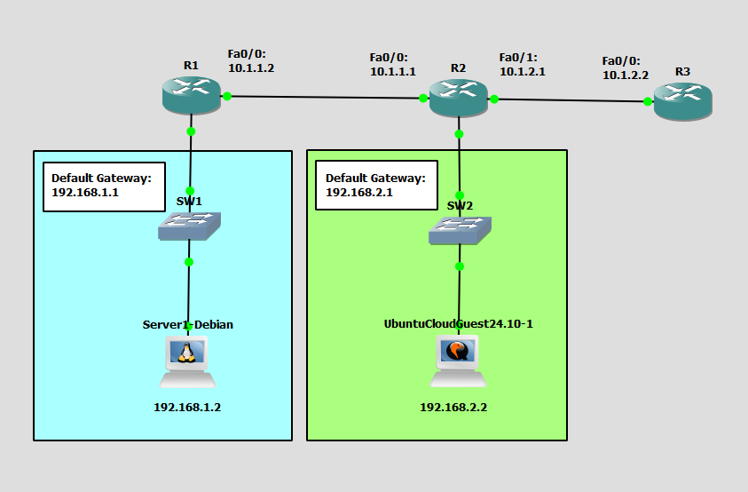

# Configure and Verify Access Control Lists
This is a guide to configure and verify access control lists (ACLs).



List of Devices:
- Routers
	- Device Name: Cisco 3745
	- Quantity: 3
- Server
	- Device Name: Debian 12.6
	- Quantity: 1
- PC:
	- Device Name: Ubuntu Cloud Guest 24.10
	- Quantity: 1
- Switches:
	- Device Name: Ethernet switch
	- Quantity: 2

## IP Address Tables of the Routers
R1:
- Interface: FastEthernet 0/0
	- IPv4 Address: 10.1.1.2
	- Subnet Mask: 255.255.255.0
- Interface: FastEthernet 0/1
	- IPv4 Address: 192.168.1.1
	- Subnet Mask: 255.255.255.0

R2:
- Interface: FastEthernet 0/0
	- IPv4 Address: 10.1.1.1
	- Subnet Mask: 255.255.255.0
- Interface: FastEthernet 0/1
	- IPv4 Address: 10.1.2.1
	- Subnet Mask: 255.255.255.0
- Interface: FastEthernet 1/0
	- IPv4 Address: 192.168.2.1
	- Subnet Mask: 255.255.255.0

R3:
- Interface: FastEthernet 0/0
	- IPv4 Address: 10.1.2.2
	- Subnet Mask: 255.255.255.0

## IP Address Table for the PC
PC1:
- IPv4 Address: 192.168.2.2
- Subnet Mask: 255.255.255.0
- Default Gateway: 192.168.2.1

## IP Address Table for the Server
Server1:
- IPv4 Address: 192.168.1.2
- Subnet Mask: 255.255.255.0
- Default Gateway: 192.168.1.1

## Setup HTTP Server
Setup the HTTP server on the Server1.

Connect Server1 to the NAT cloud. 

Open the file for configuring the network
```
debian@Server1:~$ sudo vim /etc/network/interfaces
```

Setup DHCP for Server1 in `/etc/network/interfaces`:
```
auto ens4
iface ens4 inet dhcp
```

Restart the networking service:
```
debian@Server1:~$ sudo systemctl restart networking
```

Check IP address of Server1:
```
debian@Server1:~$ ip addr show
```

Install apache and update the system
```
debian@Server1:~$ sudo apt update && sudo apt upgrade -y
debian@Server1:~$ sudo apt install apache2 -y
```

Reboot the system:
```
debian@Server1:~$ sudo reboot
```

Test if the HTTP server is up:
```
debian@Server1:~$ curl http://localhost:80
```

Once you finish setting up the apache server, remove the NAT cloud.

## Configure IP Address of the Routers
Configure the IP address of the interfaces of the routers.

Interface FastEthernet 0/0 on R1:
```
R1# conf t
R1(config)# int Fa0/0
R1(config-if)# ip add 10.1.1.2 255.255.255.0
R1(config-if)# no shut
R1(config-if)# exit
```

Interface FastEthernet 0/1 on R1:
```
R1# conf t
R1(config)# int Fa0/1
R1(config-if)# ip add 192.168.1.1 255.255.255.0
R1(config-if)# no shut
R1(config-if)# end
```

Interface FastEthernet 0/0 on R2:
```
R2# conf t
R2(config)# int Fa0/0
R2(config-if)# ip add 10.1.1.1 255.255.255.0
R2(config-if)# no shut
R2(config-if)# exit
```

Interface FastEthernet 0/1 on R2:
```
R2# conf t
R2(config)# int Fa0/1
R2(config-if)# ip add 10.1.2.1 255.255.255.0
R2(config-if)# no shut
R2(config-if)# exit
```

Interface FastEthernet 1/0 on R2:
```
R1# conf t
R1(config)# int Fa1/0
R1(config-if)# ip add 192.168.2.1 255.255.255.0
R1(config-if)# no shut
R1(config-if)# end
```

Interface FastEthernet 0/0 on R3:
```
R3# conf t
R3(config)# int Fa0/0
R3(config-if)# ip add 10.1.2.2 255.255.255.0
R3(config-if)# no shut
R3(config-if)# end
```

## Configure Static Routing
Configure static routing on the routers.

Configure a static route for R1:
```
R1# conf t
R1(config)# ip route 10.1.2.0 255.255.255.0 10.1.1.1
R1(config)# ip route 192.168.2.0 255.255.255.0 10.1.1.1
R1(config)# end
```

Configure a static route for R2:
```
R2# conf t
R2(config)# ip route 192.168.1.0 255.255.255.0 10.1.1.2
R2(config)# end
```

Configure static routes for R3:
```
R3# conf t
R3(config)# ip route 10.1.1.0 255.255.255.0 10.1.2.1
R3(config)# ip route 192.168.1.0 255.255.255.0 10.1.2.1
R3(config)# ip route 192.168.2.0 255.255.255.0 10.1.2.1
R3(config)# end
```

## Configure the IP Address for the PC
Configure the IP address for the PC.

**PC1 - Ubuntu Cloud Guest**

This is the username and password for the Ubuntu VMs:
- username: ubuntu
- password: ubuntu

On PC1, open the file, `/etc/netplan/50-cloud-init.yaml`.
```
ubuntu@PC1:~$ sudo vim /etc/netplan/50-cloud-init.yaml
```

Configure the IP address for PC1 in `/etc/netplan/50-cloud-init.yaml`:
```
network:
    version: 2
    ethernets:
        ens3:
            addresses: [192.168.2.2/24]
            routes:
              - to: default
                via: 192.168.2.1
            dhcp4: false
```

Update the networking configuration using the netplan command:
```
ubuntu@PC1:~$ sudo netplan apply
```

Check the IP address of the interface eth0:
```
ubuntu@PC1:~$ ip addr show
```

## Configure the IP Address for the Server
Configure the IP address for the server.

**Server1 - Debian**

This is the username and password for the Debian VMs:
- username: debian
- password: debian

On Server1, open the file, `/etc/network/interfaces`:
```
debian@Server1:~$ sudo vim /etc/network/interfaces
```

Configure the IP address for Server1 in `/etc/network/interfaces`:
```
auto ens4
iface ens4 inet static
    address 192.168.1.2
    netmask 255.255.255.0
    gateway 192.168.1.1
```

Restart the networking service using the rc-service command:
```
debian@Server1:~$ sudo systemctl restart networking
```

Check the IP address of the interface ens4:
```
debian@Server1:~$ ip addr show
```

## Configure SSH on the Router
Configure SSH on the router.

Generate the RSA key with 1024 bits for version 2 of SSH on R1:
```
R1# conf t
R1(config)# ip domain-name labs.networking.com
R1(config)# crypto key generate rsa
How many bits in the modulus [512]: 1024
```

Configure SSH on R1:
```
R1(config)# ip ssh version 2
R1(config)# line vty 0 4
R1(config-line)# transport input ssh
R1(config-line)# end
```

## Configure Standard Numbered ACLs
Configure standard numbered ACLs on the router.

Configure a standard numbered ACL on R1:
```
R1# conf t
R1(config)# access-list 1 deny host 10.1.2.2
R1(config)# access-list 1 permit 10.1.1.0 0.0.0.255
R1(config)# end
```

Verify a standard numbered ACL by displaying the contents of the current access lists on R1:
```
R1# show access-lists
```

## Configure Standard Named ACL
Configure standard named ACLs on the router.

Configure a standard named ACL on R3:
```
R3# conf t
R3(config)# ip access-list standard MYACL
R3(config-std-nacl)# deny 10.1.1.0 0.0.0.255
R3(config-std-nacl)# permit 10.1.2.0 0.0.0.255
R3(config-std-nacl)# end
```

## Assign Standard ACLs
Assign standard ACLs to the interfaces of the routers.

Assign standard numbered ACL to an interface of R1:
```
R1# conf t
R1(config)# interface Fa0/0
R1(config-if)# ip access-group 1 in
R1(config-if)# end
```

Verify ACL interface assignment on R1:
```
R1# show ip interface Fa0/0
```

Assign standard named ACL to an interface of R3:
```
R3# conf t
R3(config)# interface Fa0/0
R3(config-if)# ip access-group MYACL out
R3(config-if)# end
```

Verify ACL interface assignment on R3:
```
R3# show ip interface Fa0/0
```

Verify matches by displaying the contents of the current access lists on R1:
```
R1# show access-lists
```

Verify matches by displaying the contents of the current access lists on R3:
```
R3# show access-lists
```

## Configure Extended ACLs
Configure extended ACLs on the router.

Configure an extended ACL on R1:
```
R1# conf t
R1(config)# access-list 101 permit tcp 192.168.2.0 0.0.0.255 10.1.1.0 0.0.0.255 eq 22
R1(config)# access-list 101 permit tcp 192.168.2.0 0.0.0.255 192.168.1.0 0.0.0.255 eq 80
R1(config)# interface Fa0/0
R1(config-if)# ip access-group 101 in
R1(config-if)# end
```

**Note**: For the commands on configuring an extended ACL, the first IP address represents the source IP address and the second IP address represents the destination IP address.

Verify matches by displaying the contents of the current access lists on R1:
```
R1# show access-lists
```

## Configure Admin and Enable Password
Configure an admin and enable password for the routers.

Configure an admin password for R1:
```
R1# conf t
R1(config)# aaa new-model
R1(config)# aaa authentication login default local
R1(config)# username admin privilege 15 secret cisco
R1(config)# line con 0
R1(config-line)# login authentication default
R1(config-line)# exit
```

Configure an enable password for R1:
```
R1(config)# enable secret cisco
R1(config)# line vty 0 4
R1(config-line)# password cisco
R1(config-line)# login authentication default
R1(config-line)# end
```

## Configure SSH on the PC
Configure SSH on the PC. This will allow you to SSH to the routers from the PC.

Open the SSH config on PC1:
```
ubuntu@PC1:~$ vim ~/.ssh/config
```

Modify the SSH config at `~/.ssh/config` for PC1:
```
host *
		KexAlgorithms=+diffie-hellman-group1-sha1
        HostKeyAlgorithms=+ssh-rsa
        Ciphers aes128-ctr,aes192-ctr,aes256-ctr,aes128-cbc,3des-cbc
```

## Test Connections from the PC
Test the connections from the PC.

Admin password for the Cisco routers: cisco

Enable password for the Cisco routers: cisco

On PC1, go to Desktop -> Command Prompt. Test the SSH connection to R1 from PC1:
```
ubuntu@PC1:~$ ssh admin@10.1.1.2
```

Enter privileged EXEC Mode on R1:
```
R1> en
Password:

R1#
```

Check if the website is available for PC1.  
```
ubuntu@PC1:~$ curl http://192.168.1.2:80
```

## Save Router Configurations
For each router, save the running config to the startup config.

Save config for R1:
```
R1# copy run start
```

Save config for R2:
```
R2# copy run start
```

Save config for R3:
```
R3# copy run start
```

## Resources
- [show access-lists command - Cisco](https://www.cisco.com/E-Learning/bulk/public/tac/cim/cib/using_cisco_ios_software/cmdrefs/show_access-lists.htm)