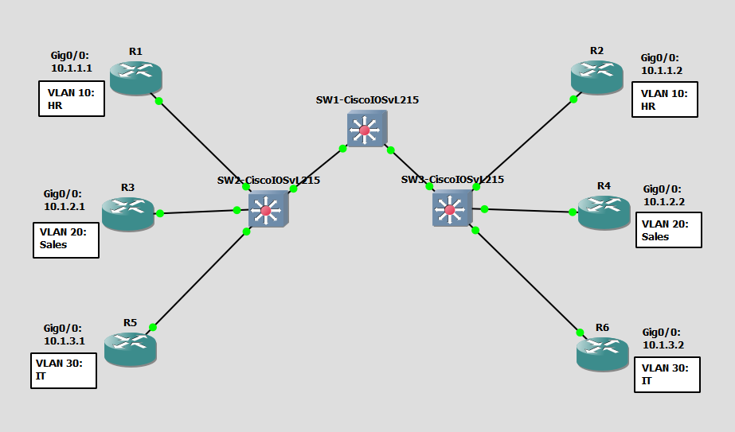

# Configure and Verify Interswitch Connectivity
This is a guide to configure and verify interswitch connectivity.



List of Devices:
1. Routers:
	1. Quantity: 6
	2. Device Name: Cisco 3745
2. Switches:
	1. Quantity: 3
	2. Device Name: Cisco IOSvL215.2

## IP Address Table of the Routers
R1:
- Interface: GigabitEthernet 0/0
	- IPv4 Address: 10.1.1.1
	- Subnet Mask: 255.255.255.0

R2:
- Interface: GigabitEthernet 0/0
	- IPv4 Address: 10.1.1.2
	- Subnet Mask: 255.255.255.0

R3:
- Interface: GigabitEthernet 0/0
	- IPv4 Address: 10.1.2.1
	- Subnet Mask: 255.255.255.0

R4:
- Interface: GigabitEthernet 0/0
	- IPv4 Address: 10.1.2.2
	- Subnet Mask: 255.255.255.0

R5:
- Interface: GigabitEthernet 0/0
	- IPv4 Address: 10.1.3.1
	- Subnet Mask: 255.255.255.0

R6:
- Interface: GigabitEthernet 0/0
	- IPv4 Address: 10.1.3.2
	- Subnet Mask: 255.255.255.0

## Configure IP Addresses for the Routers
Configure IP address for the interfaces of the routers.

Interface Fa0/0 on R1:
```
R1# conf t
R1(config)# int Fa0/0
R1(config-if)# ip add 10.1.1.1 255.255.255.0
R1(config-if)# no shut
R1(config-if)# end
```

Interface Fa0/0 on R2:
```
R2# conf t
R2(config)# int Fa0/0
R2(config-if)# ip add 10.1.1.2 255.255.255.0
R2(config-if)# no shut
R2(config-if)# end
```

Interface Fa0/0 on R3:
```
R3# conf t
R3(config)# int Fa0/0
R3(config-if)# ip add 10.1.2.1 255.255.255.0
R3(config-if)# no shut
R3(config-if)# end
```

Interface Fa0/0 on R4:
```
R4# conf t
R4(config)# int Fa0/0
R4(config-if)# ip add 10.1.2.2 255.255.255.0
R4(config-if)# no shut
R4(config-if)# end
```

Interface Fa0/0 on R5:
```
R5# conf t
R5(config)# int Fa0/0
R5(config-if)# ip add 10.1.3.1 255.255.255.0
R5(config-if)# no shut
R5(config-if)# end
```

Interface Fa0/0 on R6:
```
R6# conf t
R6(config)# int Fa0/0
R6(config-if)# ip add 10.1.3.2 255.255.255.0
R6(config-if)# no shut
R6(config-if)# end
```

## Configure VLANs
Configure VLANs for the switches.

Create VLANs for the switches.

Create VLANs for HR, Sales, and IT on SW1:
```
SW1(config)# vlan 10
SW1(config-vlan)# name HR
SW1(config-vlan)# exit
SW1(config)# vlan 20
SW1(config-vlan)# name Sales
SW1(config-vlan)# exit
SW1(config)# vlan 30
SW1(config-vlan)# name IT
SW1(config-vlan)# end
```

Create VLANs for HR, Sales, and IT on SW2:
```
SW2(config)# vlan 10
SW2(config-vlan)# name HR
SW2(config-vlan)# exit
SW2(config)# vlan 20
SW2(config-vlan)# name Sales
SW2(config-vlan)# exit
SW2(config)# vlan 30
SW2(config-vlan)# name IT
SW2(config-vlan)# end
```

Create VLANs for HR, Sales, and IT on SW3:
```
SW3(config)# vlan 10
SW3(config-vlan)# name HR
SW3(config-vlan)# exit
SW3(config)# vlan 20
SW3(config-vlan)# name Sales
SW3(config-vlan)# exit
SW3(config)# vlan 30
SW3(config-vlan)# name IT
SW3(config-vlan)# end
```

Assign VLANs for SW2 and SW3.

Assign VLANs to the interfaces on SW2:
```
SW2(config)# int Gig0/1
SW2(config-if)# switchport mode access
SW2(config-if)# switchport access vlan 10
SW2(config-if)# exit
SW2(config-if)# int Gig0/2
SW2(config-if)# switchport mode access
SW2(config-if)# switchport access vlan 20
SW2(config-if)# exit
SW2(config-if)# int Gig0/3
SW2(config-if)# switchport mode access
SW2(config-if)# switchport access vlan 30
SW2(config-if)# end
```

Assign VLANs to the interfaces on SW3:
```
SW3(config)# int Gig0/1
SW3(config-if)# switchport mode access
SW3(config-if)# switchport access vlan 10
SW3(config-if)# exit
SW3(config-if)# int Gig0/2
SW3(config-if)# switchport mode access
SW3(config-if)# switchport access vlan 20
SW3(config-if)# exit
SW3(config-if)# int Gig0/3
SW3(config-if)# switchport mode access
SW3(config-if)# switchport access vlan 30
SW3(config-if)# end
```

## Configure Trunking
Configure trunking on SW1.

On Interface Gig0/0 on SW1:
```
SW1# conf t
SW1(config)# int Gig0/0
SW1(config-if)# switchport trunk encapsulation dot1q
SW1(config-if)# switchport mode trunk
SW1(config-if)# exit
```

On Interface Gig0/1 on SW1:
```
SW1(config)# int Gig0/1
SW1(config-if)# switchport trunk encapsulation dot1q
SW1(config-if)# switchport mode trunk
SW1(config-if)# end
```

Verify trunking on SW1:
```
SW1# show int Gig0/0 switchport
SW1# show int Gig0/1 switchport
SW1# show int trunk
```

Configure trunking on SW2 and SW3. 

On Interface Gig0/0 on SW2:
```
SW2(config)# int Gig0/0
SW2(config-if)# switchport trunk encapsulation dot1q
SW2(config-if)# switchport mode trunk
SW2(config-if)# end
```

On Interface Gig0/0 on SW3:
```
SW3(config)# int Gig0/0
SW2(config-if)# switchport trunk encapsulation dot1q
SW3(config-if)# switchport mode trunk
SW3(config-if)# end
```

Verify trunking on SW2:
```
SW2# show int Gig0/0 switchport
SW2# show int trunk
```

Verify trunking on SW3:
```
SW3# show int Gig0/0 switchport
SW3# show int trunk
```

## Test Router Connectivity
Test the connectivity between the routers to verify that you configured the VLANs properly.

**VLAN 10: HR**

Ping R2 from R1
```
R1# ping 10.1.1.2
```

Ping R1 from R2
```
R2# ping 10.1.1.1
```

**VLAN 20: Sales**

Ping R4 from R3
```
R3# ping 10.1.2.2
```

Ping R3 from R4
```
R4# ping 10.1.2.1
```

**VLAN 30: IT**

Ping R6 from R5
```
R5# ping 10.1.3.2
```

Ping R5 from R6
```
R6# ping 10.1.3.1
```

## Save Router Configurations

Go to each router and save the running configuration to the startup configuration.

Save the config for R1:
```
R1# copy run start
```

Save the config for R2:
```
R2# copy run start
```

Save the config for R3:
```
R3# copy run start
```

Save the config for R4:
```
R4# copy run start
```

Save the config for R5:
```
R5# copy run start
```

Save the config for R6:
```
R6# copy run start
```

## Save Switch Configurations

Go to each switch and save the running configuration to the startup configuration.

Save the config for SW1:
```
SW1# copy run start
```

Save the config for SW2:
```
SW2# copy run start
```

Save the config for SW3:
```
SW3# copy run start
```

## Resources
- [3.4.5 Packet Tracer – Configure Trunks (Instructions Answer) - ITExamAnswers.net](https://itexamanswers.net/3-4-5-packet-tracer-configure-trunks-instructions-answer.html)
- [3.3.12 Packet Tracer – VLAN Configuration (Instructions Answer) - ITExamAnswers.net](https://itexamanswers.net/3-3-12-packet-tracer-vlan-configuration-instructions-answer.html)