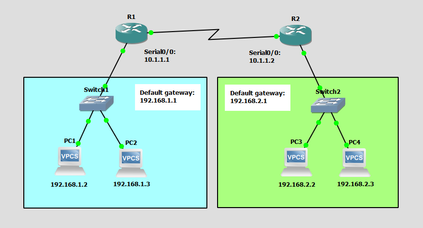

# Configure and Verify IPv4 Addressing
This is a guide to configure and verify IPv4 addressing.



## Devices
Router:
- Router Model Name: Cisco 3745
- Quantity: 2

Switch:
- Switch Model Name: Ethernet switch
- Quantity: 2

PC:
- PC Model Name: VPCS
- Quantity: 4

## IP Address Table for the PCs
PC1:
- IPv4 Address: 192.168.1.2
- Subnet Mask: 255.255.255.0
- Default Gateway: 192.168.1.1

PC2:
- IPv4 Address: 192.168.1.3
- Subnet Mask: 255.255.255.0
- Default Gateway: 192.168.1.1

PC3:
- IPv4 Address: 192.168.2.2
- Subnet Mask: 255.255.255.0
- Default Gateway: 192.168.2.1

PC4:
- IPv4 Address: 192.168.2.3
- Subnet Mask: 255.255.255.0
- Default Gateway: 192.168.2.1

## IP Address Table for the Routers
R1:
- Serial0/0: 10.1.1.1
- Subnet Mask: 255.255.255.0
- FastEthernet0/0: 192.168.1.1
- Subnet Mask: 255.255.255.0

R2:
- Serial0/0: 10.1.1.2
- Subnet Mask: 255.255.255.0
- FastEthernet0/0: 192.168.2.1
- Subnet Mask: 255.255.255.0

## Configure the IP Address for the PCs
Configure the IP address for the PCs.

Set the IP address and the default gateway address for PC1:
```
PC1> ip 192.168.1.2/24 192.168.1.1
```

Set the IP address and the default gateway address for PC2:
```
PC2> ip 192.168.1.3/24 192.168.1.1
```

Set the IP address and the default gateway address for PC3:
```
PC3> ip 192.168.2.2/24 192.168.2.1
```

Set the IP address and the default gateway address for PC4:
```
PC4> ip 192.168.2.3/24 192.168.2.1
```

## Configure IP Address of the Routers
Configure the IP address of the interfaces of the routers.

Interface Serial0/0 for R1:
```
R1#config t
R1(config)#int Serial0/0
R1(config-if)#ip add 10.1.1.1 255.255.255.0
R1(config-if)#no shut
R1(config-if)#exit
```

Interface FastEthernet0/0 for R1:
```
R1#config t
R1(config)#int FastEthernet0/0
R1(config-if)#ip add 192.168.1.1 255.255.255.0
R1(config-if)#no shut
R1(config-if)#exit
```

Interface Serial0/0 for R2:
```
R2#config t
R2(config)#int Serial0/0
R2(config-if)#ip add 10.1.1.2 255.255.255.0
R2(config-if)#no shut
R1(config-if)#exit
```

Interface FastEthernet0/0 for R2:
```
R2#config t 
R2(config)#int FastEthernet0/0
R2(config-if)#ip add 192.168.2.1 255.255.255.0  
R2(config-if)#no shut
R1(config-if)#exit
```

## Check Connectivity Between the PCs
Ping each PC to check if the PCs can communicate with each other.

**PC1**

Ping the devices from PC1

Ping R1:
```
PC1> ping 192.168.1.1
```

Ping PC2:
```
PC1> ping 192.168.1.3
```

**PC2**

Ping the devices from PC2

Ping R1:
```
PC2> ping 192.168.1.1
```

Ping PC1:
```
PC2> ping 192.168.1.2
```

**PC3**

Ping the devices from PC3

Ping R2:
```
PC3> ping 192.168.2.1
```

Ping PC4:
```
PC3> ping 192.168.2.3
```

**PC4**

Ping the devices from PC4

Ping R2:
```
PC4> ping 192.168.2.1
```

Ping PC3:
```
PC4> ping 192.168.2.2
```

These should all work.

## Save PC Configurations
Save the configs of each PC.

**Note**: Make sure to save the configuration of the PCs. This will save your progress. Whenever you close the project, your configurations will be saved.

Save the PC config for PC1:
```
PC1> save
```

Save the PC config for PC2:
```
PC2> save
```

Save the PC config for PC3:
```
PC3> save
```

Save the PC config for PC4:
```
PC4> save
```

## Save Router Configurations
For each router, save the running config to the startup config.

**Note**: Make sure to save the configuration of the routers. This will save your progress. Whenever you close the project, your configurations will be saved.

Save config for R1:
```
R1# copy run start
```

Save config for R2:
```
R2# copy run start
```

## Resources
- [How to Configure VPCS on GNS3 - SYSNETTECH Solutions](https://www.sysnettechsolutions.com/en/configure-vpcs-gns3/#how-to-use-virtual-pc-simulator-vpcs-step-2)
- [Your First Cisco Topology - GNS3 Documentation](https://docs.gns3.com/docs/getting-started/your-first-cisco-topology)
- [VPCS - GNS3 Documentation](https://docs.gns3.com/docs/emulators/vpcs/)