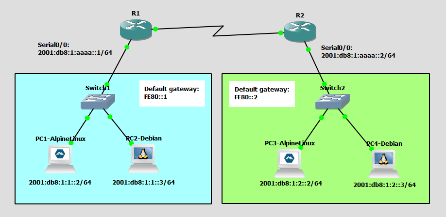

# Configure and Verify IPv6 Addressing
This is a guide to configure and verify IPv6 addressing.



List of Devices:
- Routers:
	- Device Name: Cisco 3745
	- Quantity: 2
- Switches:
	- Device Name: Ethernet switch
	- Quantity: 2
- Alpine Linux PCs:
	- Device Name: Alpine Linux Virt 3.18.4
	- Quantity: 2
- Debian Linux PCs:
	- Device Name: Debian 12.6
	- Quantity: 2

## IPv6 Address Table for the PCs
PC1:
- IPv6 Address: 2001:db8:1:1::2/64
- Default Gateway: FE80::1

PC2:
- IPv6 Address: 2001:db8:1:1::3/64
- Default Gateway: FE80::1

PC3:
- IPv6 Address: 2001:db8:1:2::2/64
- Default Gateway: FE80::2

PC4:
- IPv6 Address: 2001:db8:1:2::3/64
- Default Gateway: FE80::2

## IPv6 Address Table for the Routers
R1:
- Interface: FastEthernet0/0: 
	- Global Unicast Address: 2001:DB8:1:1::1/64
	- Link-local Address: FE80::1 (Default Gateway)
- Interface: Serial0/0: 
	- IPv6 Address: 2001:db8:1:aaaa::1/64

R2:
- Interface: FastEthernet0/0: 
	- Global Unicast Address: 2001:DB8:1:2::1/64
	- Link-local Address: FE80::2 (Default Gateway)
- Interface: Serial0/0: 
	- IPv6 Address:  2001:db8:1:aaaa::2/64

## Configure IPv6 Address of the Routers
Configure the IPv6 address for the interfaces of the routers.

Interface Serial0/0 for R1:
```
R1# conf t
R1(config)# ipv6 unicast-routing
R1(config)# int Se0/0
R1(config-if)# ipv6 add 2001:db8:1:aaaa::1/64
R1(config-if)# no shut
R1(config-if)# exit
```

Interface FastEthernet0/0 for R1:
```
R1# conf t
R1(config)# int Fa0/0
R1(config-if)# ipv6 add 2001:db8:1:1::1/64
R1(config-if)# ipv6 add fe80::1 link-local
R1(config-if)# no shut
R1(config-if)# end
```

Interface Serial0/0 for R2:
```
R2# conf t
R2(config)# ipv6 unicast-routing
R2(config)# int Se0/0
R2(config-if)# ipv6 add 2001:db8:1:aaaa::2/64
R2(config-if)# no shut
R2(config-if)# exit
```

Interface FastEthernet0/0 for R2:
```
R2# conf t
R2(config)# int Fa0/0
R2(config-if)# ipv6 add 2001:db8:1:2::1/64
R2(config-if)# ipv6 add fe80::2 link-local
R2(config-if)# no shut
R2(config-if)# end
```

## Configure the IPv6 Address for the PCs
Configure the IPv6 address for the PCs.

**PC1 - Alpine Linux**

On PC1, open the file, `/etc/network/interfaces`.
```
PC1:~# vi /etc/network/interfaces
```

Configure the IP address for PC1 in `/etc/network/interfaces`:
```
auto eth0
iface eth0 inet6 static
    address 2001:db8:1:1::2/64
    gateway fe80::1
```

Restart the networking service using the rc-service command
```
PC1:~# rc-service networking restart
```

Check the IP address of the interface eth0:
```
PC1:~# ip addr show
```

**PC2 - Debian**

This is the username and password for the Debian VMs:
- username: debian
- password: debian

On PC2, open the file, `/etc/network/interfaces`.
```
debian@PC2:~$ sudo vim /etc/network/interfaces
```

Configure the IP address for PC2 in `/etc/network/interfaces`:
```
auto ens4
iface ens4 inet6 static
    address 2001:db8:1:1::3/64
    gateway fe80::1
```

Restart the networking service using the rc-service command
```
debian@PC2:~$ sudo systemctl restart networking
```

Check the IP address of the interface ens4:
```
debian@PC2:~$ ip addr show
```

**PC3 - Alpine Linux**

On PC3, open the file, `/etc/network/interfaces`.
```
PC3:~# vi /etc/network/interfaces
```

Configure the IP address for PC3 in `/etc/network/interfaces`:
```
auto eth0
iface eth0 inet6 static
    address 2001:db8:1:2::2/64
    gateway fe80::2
```

Restart the networking service using the rc-service command
```
PC3:~# rc-service networking restart
```

Check the IP address of the interface eth0:
```
PC3:~# ip addr show
```

**PC4 - Debian**

On PC4, open the file, `/etc/network/interfaces`.
```
debian@PC4:~$ sudo vim /etc/network/interfaces
```

Configure the IP address for PC4 in `/etc/network/interfaces`:
```
auto ens4
iface ens4 inet6 static
    address 2001:db8:1:2::3/64
    gateway fe80::2
```

Restart the networking service using the rc-service command
```
debian@PC4:~$ sudo systemctl restart networking
```

Check the IP address of the interface ens4:
```
debian@PC4:~$ ip addr show
```

## Check Connectivity Between the PCs
Ping each PC to check if the PCs can communicate with each other.

**PC1 - Alpine Linux**

Ping devices from PC1

Ping R1:
```
PC1:~# ping fe80::1
```

Ping PC2:
```
PC1:~# ping 2001:db8:1:1::3
```

**PC2 - Debian**

Ping devices from PC2

Ping R1:
```
debian@PC2:~$ ping fe80::1
```

Ping PC1:
```
debian@PC2:~$ ping 2001:db8:1:1::2
```

**PC3 - Alpine Linux**

Ping devices from PC3

Ping R2:
```
PC3:~# ping fe80::2
```

Ping PC4:
```
PC3:~# ping 2001:db8:1:2::3
```

**PC4 - Debian**

Ping devices from PC4

Ping R2:
```
debian@PC4:~$ ping fe80::2
```

Ping PC3:
```
debian@PC4:~$ ping 2001:db8:1:2::2
```

These should all work.

## Save Router Configurations
For each router, save the running config to the startup config.

**Note**: Make sure to save the configuration of the routers. This will save your progress. Whenever you close the project, your configurations will be saved.

Save config for R1:
```
R1# copy run start
```

Save config for R2:
```
R2# copy run start
```

## Resources
- [How to configure static IP address on Alpine Linux - nixCraft](https://www.cyberciti.biz/faq/how-to-configure-static-ip-address-on-alpine-linux/)
- [NetworkConfiguration - Debian](https://wiki.debian.org/NetworkConfiguration)
- [Configure Networking - Alpine Linux](https://wiki.alpinelinux.org/wiki/Configure_Networking)