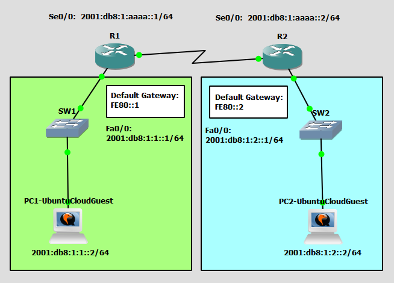

# Configure and Verify IPv6 Static Routing
This is a guide to configure and verify IPv6 static routing.



List of Devices:
- Routers
	- Num: 2
	- Device Name: Cisco 3745
- Switches
	- Num: 2
	- Device Name: Ethernet switch
- PCs
	- Num: 2
	- Device Name: Ubuntu Cloud Guest 24.10

## IPv6 Address Table for the Routers
R1:
- Interface: FastEthernet0/0
	- Global Unicast Address: 2001:db8:1:1::1/64
	- Link-local Address: FE80::1 (Default Gateway)
- Interface: Serial0/0
	- IPv6 Address: 2001:db8:1:aaaa::1/64

R2:
- Interface: FastEthernet0/0
	- Global Unicast Address: 2001:db8:1:2::1/64
	- Link-local Address: FE80::2 (Default Gateway)
- Interface: Serial0/0
	- IPv6 Address: 2001:db8:1:aaaa::2/64

## IPv6 Address Table for the PCs
PC1:
- IPv6 Address: 2001:db8:1:1::2/64
- Default Gateway: FE80::1

PC2:
- IPv6 Address: 2001:db8:1:2::2/64
- Default Gateway: FE80::2

## Configure IPv6 Addresses for the Routers
Configure the IPv6 address for the serial interfaces of the routers.

Interface Serial0/0 for R1:
```
R1# conf t
R1(config)# ipv6 unicast-routing
R1(config)# int Se0/0
R1(config-if)# ipv6 add 2001:db8:1:aaaa::1/64
R1(config-if)# no shut
R1(config-if)# exit
```

Interface FastEthernet0/0 for R1:
```
R1# conf t
R1(config)# int Fa0/0
R1(config-if)# ipv6 add 2001:db8:1:1::1/64
R1(config-if)# ipv6 add fe80::1 link-local
R1(config-if)# no shut
R1(config-if)# end
```

Interface Serial0/0 for R2:
```
R2# conf t
R2(config)# ipv6 unicast-routing
R2(config)# int Se0/0
R2(config-if)# ipv6 add 2001:db8:1:aaaa::2/64
R2(config-if)# no shut
R2(config-if)# exit
```

Interface FastEthernet0/0 for R2:
```
R2# conf t
R2(config)# int Fa0/0
R2(config-if)# ipv6 add 2001:db8:1:2::1/64
R2(config-if)# ipv6 add fe80::2 link-local
R2(config-if)# no shut
R2(config-if)# end
```

## Configure IPv6 Static Routing
Configure IPv6 static routing for the routers.

Configure static routing for R1:
```
R1# conf t
R1(config)# ipv6 route 2001:db8:1:2::0/64 Se0/0
R1(config)# end
```

Configure static routing for R2:
```
R2# conf t
R2(config)# ipv6 route 2001:db8:1:1::0/64 Se0/0
R1(config)# end
```

## Configure the IPv6 Address for the PCs
Configure the IPv6 address for the PCs.

**PC1 - Ubuntu Cloud Guest**

This is the username and password for the Ubuntu VMs:
- username: ubuntu
- password: ubuntu

On PC1, open the file, `/etc/netplan/50-cloud-init.yaml`.
```
ubuntu@PC1:~$ sudo vim /etc/netplan/50-cloud-init.yaml
```

Configure the IP address for PC1 in `/etc/netplan/50-cloud-init.yaml`:
```
network:
    version: 2
    ethernets:
        ens3:
            addresses: [2001:db8:1:1::2/64]
            routes:
              - to: default
                via: fe80::1
            dhcp6: false
```

Update the networking configuration using the netplan command:
```
ubuntu@PC1:~$ sudo netplan apply
```

Check the IP address of the interface ens3:
```
ubuntu@PC1:~$ ip addr show
```

**PC2 - Ubuntu Cloud Guest**

This is the username and password for the Ubuntu VMs:
- username: ubuntu
- password: ubuntu

On PC2, open the file, `/etc/netplan/50-cloud-init.yaml`:
```
ubuntu@PC2:~$ sudo vim /etc/netplan/50-cloud-init.yaml
```

Configure the IP address for PC2 in `/etc/netplan/50-cloud-init.yaml`:
```
network:
    version: 2
    ethernets:
        ens3:
            addresses: [2001:db8:1:2::2/64]
            routes:
              - to: default
                via: fe80::2
            dhcp6: false
```

Update the networking configuration using the netplan command:
```
ubuntu@PC2:~$ sudo netplan apply
```

Check the IP address of the interface ens3:
```
ubuntu@PC2:~$ ip addr show
```

## Check Connectivity Between the PCs
Ping each PC to check if the PCs can communicate with each other.

**PC1 - UbuntuCloudGuest**

Ping the PC from PC1.

Ping PC2:
```
ubuntu@PC1:~$ ping 2001:db8:1:2::2
```

**PC2 - UbuntuCloudGuest**

Ping the PC from PC2.

Ping PC1:
```
ubuntu@PC2:~$ ping 2001:db8:1:1::2
```

## Save Router Configurations
For each router, save the running config to the startup config.

Save config for R1:
```
R1# copy run start
```

Save config for R2:
```
R2# copy run start
```

## Resources
- [12.6.6 Packet Tracer – Configure IPv6 Addressing (Answers) - ITExamAnswers.net](https://itexamanswers.net/12-6-6-packet-tracer-configure-ipv6-addressing-answers.html)
- [Cisco Packet Tracer Basic Networking - IPV6 Static Routing using 2 routers - Suhag's Cisco and Tech](https://youtu.be/D3ziy42LLfw?is=0aYOdU3CZH6x-Awf)