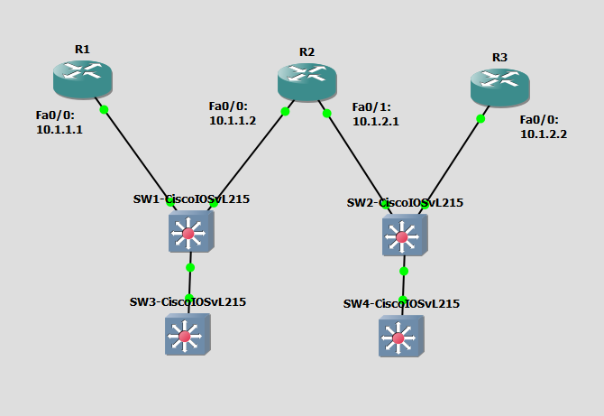

# Configure and Verify Layer 2 Discovery Protocols
This is a guide to configure and verify layer 2 discovery protocols. You will configure and verify Cisco Discovery Protocol (CDP) on the switches and routers. You will configure and verify Link Layer Discovery Protocol (LLDP) on the switches.



List of Devices:
- Routers:
	- Device Name: Cisco 3745
	- Quantity: 3
- Switches:
	- Model Name: Cisco IOSvL215.2
	- Quantity: 4

## IP Address Table for the Routers
R1:
- Interface: FastEthernet0/0: 
	- IPv4 Address: 10.1.1.1
	- Subnet Mask: 255.255.255.0

R2:
- Interface: FastEthernet0/0: 
	- IPv4 Address: 10.1.1.2
	- Subnet Mask: 255.255.255.0
- Interface: FastEthernet0/1: 
	- IPv4 Address: 10.1.2.1
	- Subnet Mask: 255.255.255.0

R3:
- Interface: FastEthernet0/0: 
	- IPv4 Address: 10.1.2.2
	- Subnet Mask: 255.255.255.0

## Configure IP Addresses for the Routers
Configure the IP addresses for the interfaces of the routers.

Interface FastEthernet0/0 on R1:
```
R1# conf t
R1(config)# int Fa0/0
R1(config-if)# ip add 10.1.1.1 255.255.255.0
R1(config-if)# no shut
R1(config-if)# end
```

Interface FastEthernet0/0 on R2:
```
R2# conf t
R2(config)# int Fa0/0
R2(config-if)# ip add 10.1.1.2 255.255.255.0
R2(config-if)# no shut
R2(config-if)# exit
```

Interface FastEthernet0/1 on R2:
```
R2# conf t
R2(config)# int Fa0/1
R2(config-if)# ip add 10.1.2.1 255.255.255.0
R2(config-if)# no shut
R2(config-if)# end
```

Interface FastEthernet0/0 on R3:
```
R3# conf t
R3(config)# int Fa0/0
R3(config-if)# ip add 10.1.2.2 255.255.255.0
R3(config-if)# no shut
R3(config-if)# end
```

## Configure and Verify CDP
Configure and verify Cisco Discovery Protocol (CDP) on the switches.

**SW1**

Ensure CDP is running on SW1:
```
SW1> en
SW1# conf t
SW1(config)# cdp run
```

Ensure CDP is running on the interfaces.

Interface GigabitEthernet0/0 on SW1:
```
SW1(config)# int Gig0/0
SW1(config-if)# cdp enable
SW1(config-if)# exit
```

Interface GigabitEthernet0/1 on SW1:
```
SW1(config)# int Gig0/1
SW1(config-if)# cdp enable
SW1(config-if)# end
```

Verify that CDP is running globally on SW1:
```
SW1# show cdp
```

Verify that CDP is enabled on the interfaces.

Interface GigabitEthernet0/0 on SW1:
```
SW1# show cdp int Gig0/0
```

Interface GigabitEthernet0/1 on SW1:
```
SW1# show cdp int Gig0/1
```

View the information collected by CDP about neighboring devices:
```
SW1# show cdp neighbors detail
```

**SW2**

Ensure CDP is running on SW2:
```
SW2> en
SW2# conf t
SW2(config)# cdp run
```

Ensure CDP is running on the interfaces.

Interface GigabitEthernet0/0 on SW2:
```
SW2(config)# int Gig0/0
SW2(config-if)# cdp enable
SW2(config-if)# exit
```

Interface GigabitEthernet0/1 on SW2:
```
SW2(config)# int Gig0/1
SW2(config-if)# cdp enable
SW2(config-if)# end
```

Verify that CDP is running globally on SW1:
```
SW2# show cdp
```

Verify that CDP is enabled on the interfaces.

Interface GigabitEthernet0/0 on SW2:
```
SW2# show cdp int Gig0/0
```

Interface GigabitEthernet0/1 on SW2:
```
SW2# show cdp int Gig0/1
```

View the information collected by CDP about neighboring devices:
```
SW2# show cdp neighbors detail
```

## Configure and Verify LLDP
Configure and verify Link Layer Discovery Protocol (LLDP) on the switches.

**SW1**

Ensure LLDP is running globally on SW1:
```
SW1# conf t
SW1(config)# lldp run
```

Ensure LLDP is running on the interfaces.

Interface GigabitEthernet0/2 on SW1:
```
SW1(config)# int Gig0/2
SW1(config-if)# lldp transmit
SW1(config-if)# lldp receive
SW1(config-if)# end
```

Verify that LLDP is running globally on SW1:
```
SW1# show lldp
```

**SW2**

Ensure LLDP is running globally on SW2:
```
SW2# conf t
SW2(config)# lldp run
```

Ensure LLDP is running on the interfaces.

Interface GigabitEthernet0/2 on SW2:
```
SW2(config)# int Gig0/2
SW2(config-if)# lldp transmit
SW2(config-if)# lldp receive
SW2(config-if)# end
```

Verify that LLDP is running globally on SW2:
```
SW2# show lldp
```

**SW3**

Ensure LLDP is running globally on SW3:
```
SW3# conf t
SW3(config)# lldp run
```

Ensure LLDP is running on the interfaces.

Interface GigabitEthernet0/0 on SW3:
```
SW3(config)# int Gig0/0
SW3(config-if)# lldp transmit
SW3(config-if)# lldp receive
SW3(config-if)# end
```

Verify that LLDP is running globally on SW3:
```
SW3# show lldp
```

**SW4**

Ensure LLDP is running globally on SW3:
```
SW4# conf t
SW4(config)# lldp run
```

Ensure LLDP is running on the interfaces.

Interface GigabitEthernet0/0 on SW4:
```
SW4(config)# int Gig0/0
SW4(config-if)# lldp transmit
SW4(config-if)# lldp receive
SW4(config-if)# end
```

Verify that LLDP is running globally on SW4:
```
SW4# show lldp
```

Show neighboring devices of the switches.

View the information collected by LLDP about neighboring devices on SW1:
```
SW1# show lldp neighbors detail
```

View the information collected by LLDP about neighboring devices on SW2:
```
SW2# show lldp neighbors detail
```

View the information collected by LLDP about neighboring devices on SW3:
```
SW3# show lldp neighbors detail
```

View the information collected by LLDP about neighboring devices on SW4:
```
SW4# show lldp neighbors detail
```

## Check Connectivity Between the Routers
Ping each PC to check if the routers can communicate with each other.

**R1**

Ping routers from R1.

Ping R2:
```
R1# ping 10.1.1.2
```

**R2**

Ping routers from R2.

Ping R1:
```
R2# ping 10.1.1.1
```

Ping R3:
```
R2# ping 10.1.2.2
```

**R3**

Ping routers from R3.

Ping R2:
```
R1# ping 10.1.2.1
```

## Save Router Configurations
Go to each router and save the running configuration to the startup configuration.

Save the config for R1:
```
R1# copy run start
```

Save the config for R2:
```
R2# copy run start
```

Save the config for R3:
```
R3# copy run start
```

## Save Switch Configurations
Go to each switch and save the running configuration to the startup configuration.

Save the config for SW1:
```
SW1# copy run start
```

Save the config for SW2:
```
SW2# copy run start
```

Save the config for SW3:
```
SW3# copy run start
```

Save the config for SW4:
```
SW4# copy run start
```