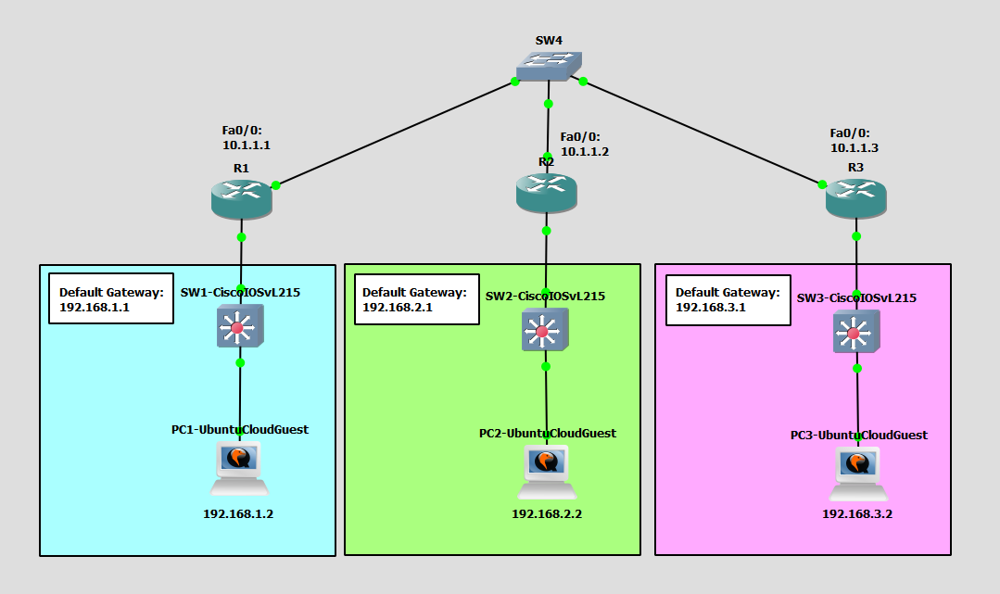

# Configure and Verify Layer 2 Security Features
This is a guide to configure and verify layer 2 security features. The Layer 2 security mechanisms that are being used in this guide are port security, DHCP snooping, and dynamic ARP inspection.



List of Devices:
- Switch:
	- Device Name: Ethernet switch
	- Quantity: 1
- Cisco Switches:
	- Device Name: Cisco IOSvL215.2
	- Quantity: 3
- Routers:
	- Device Name: Cisco 3745
	- Quantity: 3
- PCs:
	- Device Name: Ubuntu Cloud Guest 24.10
	- Quantity: 3

## IP Address Tables of the Routers
R1:
- Interface: FastEthernet 0/0
	- IPv4 Address: 10.1.1.1
	- Subnet Mask: 255.255.255.0
- Interface: FastEthernet 0/1
	- IPv4 Address: 192.168.1.1
	- Subnet Mask: 255.255.255.0

R2:
- Interface: FastEthernet 0/0
	- IPv4 Address: 10.1.1.2
	- Subnet Mask: 255.255.255.0
- Interface: FastEthernet 0/1
	- IPv4 Address: 192.168.2.1
	- Subnet Mask: 255.255.255.0

R3:
- Interface: FastEthernet 0/0
	- IPv4 Address: 10.1.1.3
	- Subnet Mask: 255.255.255.0
- Interface: FastEthernet 0/1
	- IPv4 Address: 192.168.3.1
	- Subnet Mask: 255.255.255.0

## IP Address Table for the PCs
PC1:
- IPv4 Address: 192.168.1.2
- Subnet Mask: 255.255.255.0
- Default Gateway: 192.168.1.1

PC2:
- IPv4 Address: 192.168.2.2
- Subnet Mask: 255.255.255.0
- Default Gateway: 192.168.2.1

PC3:
- IPv4 Address: 192.168.3.2
- Subnet Mask: 255.255.255.0
- Default Gateway: 192.168.3.1

## Configure IP Address of the Routers
Configure the IP address of the interfaces of the routers.

Interface FastEthernet 0/0 on R1:
```
R1# conf t
R1(config)# int Fa0/0
R1(config-if)# ip add 10.1.1.1 255.255.255.0
R1(config-if)# no shut
R1(config-if)# exit
```

Interface FastEthernet 0/1 on R1:
```
R1(config)# int Fa0/1
R1(config-if)# ip add 192.168.1.1 255.255.255.0
R1(config-if)# no shut
R1(config-if)# end
```

Interface FastEthernet 0/0 on R2:
```
R2# conf t
R2(config)# int Fa0/0
R2(config-if)# ip add 10.1.1.2 255.255.255.0
R2(config-if)# no shut
R2(config-if)# exit
```

Interface FastEthernet 0/1 on R2:
```
R2(config)# int Fa0/1
R2(config-if)# ip add 192.168.2.1 255.255.255.0
R2(config-if)# no shut
R2(config-if)# end
```

Interface FastEthernet 0/0 on R3:
```
R3# conf t
R3(config)# int Fa0/0
R3(config-if)# ip add 10.1.1.3 255.255.255.0
R3(config-if)# no shut
R3(config-if)# exit
```

Interface FastEthernet 0/1 on R3:
```
R3(config)# int Fa0/1
R3(config-if)# ip add 192.168.3.1 255.255.255.0
R3(config-if)# no shut
R3(config-if)# end
```

## Configure the IP Address for the PCs
Configure the IP address for the PCs.

**PC1 - Ubuntu Cloud Guest**

This is the username and password for the Ubuntu VMs:
- username: ubuntu
- password: ubuntu

On PC1, open the file, `/etc/netplan/50-cloud-init.yaml`.
```
ubuntu@PC1:~$ sudo vim /etc/netplan/50-cloud-init.yaml
```

Configure the IP address for PC1 in `/etc/netplan/50-cloud-init.yaml`:
```
network:
    version: 2
    ethernets:
        ens3:
            addresses: [192.168.1.2/24]
            routes:
              - to: default
                via: 192.168.1.1
            dhcp4: false
```

Update the networking configuration using the netplan command:
```
ubuntu@PC1:~$ sudo netplan apply
```

Check the IP address of the interface ens3:
```
ubuntu@PC1:~$ ip addr show
```

**PC2 - Ubuntu Cloud Guest**

This is the username and password for the Ubuntu VMs:
- username: ubuntu
- password: ubuntu

On PC2, open the file, `/etc/netplan/50-cloud-init.yaml`.
```
ubuntu@PC2:~$ sudo vim /etc/netplan/50-cloud-init.yaml
```

Configure the IP address for PC2 in `/etc/netplan/50-cloud-init.yaml`:
```
network:
    version: 2
    ethernets:
        ens3:
            addresses: [192.168.2.2/24]
            routes:
              - to: default
                via: 192.168.2.1
            dhcp4: false
```

Update the networking configuration using the netplan command:
```
ubuntu@PC2:~$ sudo netplan apply
```

Check the IP address of the interface ens3:
```
ubuntu@PC2:~$ ip addr show
```

**PC3 - Ubuntu Cloud Guest**

This is the username and password for the Ubuntu VMs:
- username: ubuntu
- password: ubuntu

On PC3, open the file, `/etc/netplan/50-cloud-init.yaml`.
```
ubuntu@PC3:~$ sudo vim /etc/netplan/50-cloud-init.yaml
```

Configure the IP address for PC1 in `/etc/netplan/50-cloud-init.yaml`:
```
network:
    version: 2
    ethernets:
        ens3:
            addresses: [192.168.3.2/24]
            routes:
              - to: default
                via: 192.168.3.1
            dhcp4: false
```

Update the networking configuration using the netplan command:
```
ubuntu@PC3:~$ sudo netplan apply
```

Check the IP address of the interface ens3:
```
ubuntu@PC3:~$ ip addr show
```
## Configure and Verify Port Security
Configure and verify port security on the switch.

Configure port security on SW1:
```
SW1# conf t
SW1(config)# interface Gig0/1
SW1(config-if)# switchport mode access
SW1(config-if)# switchport port-security
SW1(config-if)# end
```

Verify port security on SW1:
```
SW1# show port-security interface Gig0/1
```

## Configure Static Port Security
Configure and verify static port security on the switch.

On PC2, use the command `ip` to get the MAC address of the ens3 interface:
```
ubuntu@PC2:~$ ip link show
```

In my case, the MAC address of PC2 is  0c:50:2c:b0:00:00.

Configure static port security on SW2:
```
SW2# conf t
SW2(config)# interface Gig0/1
SW2(config-if)# switchport mode access
SW2(config-if)# switchport port-security maximum 1
SW2(config-if)# switchport port-security mac-address 0c50.2cb0.0000
SW2(config-if)# switchport port-security
SW2(config-if)# end
```

Verify static port security on SW2:
```
SW2# show port-security interface Gig0/1
```

## Configure and Verify Sticky MAC Address Learning
Configure and verify sticky MAC address learning on the switch.

Configure sticky MAC address learning on SW3:
```
SW3# conf t
SW3(config)# interface Gig0/1
SW3(config-if)# switchport mode access
SW3(config-if)# switchport port-security maximum 1
SW3(config-if)# switchport port-security mac-address sticky
SW3(config-if)# switchport port-security
SW3(config-if)# end
```

Verify sticky MAC address learning on SW3:
```
SW3# show port-security interface Gig0/1
```

Save the running config to the startup config on SW3:
```
SW3# copy running-config startup-config
```

## Configure DHCP Snooping
Configure DHCP snooping on the switches.

Configure DHCP snooping on SW1:
```
SW1# conf t
SW1(config)# ip dhcp snooping
SW1(config)# ip dhcp snooping vlan 100,200,300
SW1(config)# interface range Gig0/1, Gig3/3
SW1(config-if-range)# ip dhcp snooping trust
SW1(config-if-range)# end
```

Configure DHCP snooping on SW2:
```
SW2# conf t
SW2(config)# ip dhcp snooping
SW2(config)# ip dhcp snooping vlan 100,200,300
SW2(config)# interface range Gig0/1, Gig3/3
SW2(config-if-range)# ip dhcp snooping trust
SW2(config-if-range)# end
```

Configure DHCP snooping on SW3:
```
SW3# conf t
SW3(config)# ip dhcp snooping
SW3(config)# ip dhcp snooping vlan 100,200,300
SW3(config)# interface range Gig0/1, Gig3/3
SW3(config-if-range)# ip dhcp snooping trust
SW3(config-if-range)# end
```

## Configure DAI
Configure DAI (Dynamic ARP Inspection) on the switches.

Configure DAI on SW1:
```
SW1# conf t
SW1(config)# ip arp inspection vlan 100,200,300
SW1(config)# end
```

Configure DAI on SW2:
```
SW2# conf t
SW2(config)# ip arp inspection vlan 100,200,300
SW2(config)# end
```

Configure DAI on SW3:
```
SW3# conf t
SW3(config)# ip arp inspection vlan 100,200,300
SW3(config)# end
```

## Configure the DAI Trusted Port
Configure a DAI trusted port for the switches.

Configure DAI trusted port for SW1:
```
SW1# conf t
SW1(config)# interface Gig0/1
SW1(config-if)# ip arp inspection trust
SW1(config-if)# end
```

Configure DAI trusted port for SW2:
```
SW2# conf t
SW2(config)# interface Gig0/1
SW2(config-if)# ip arp inspection trust
SW2(config-if)# end
```

Configure DAI trusted port for SW3:
```
SW3# conf t
SW3(config)# interface Gig0/1
SW3(config-if)# ip arp inspection trust
SW3(config-if)# end
```

## Check Connectivity Between the Devices
Ping each router to check if the PCs can communicate with the routers.

**PC1 - UbuntuCloudGuest**

Ping the router from PC1.

Ping R1:
```
ubuntu@PC2:~$ ping 192.168.1.1
```

**PC2 - UbuntuCloudGuest**

Ping the router from PC2.

Ping R2:
```
ubuntu@PC2:~$ ping 192.168.2.1
```

**PC3 - UbuntuCloudGuest**

Ping the router from PC3.

Ping R3:
```
ubuntu@PC3:~$ ping 192.168.3.1
```

## Save Router Configurations
For each router, save the running config to the startup config.

Save config for R1:
```
R1# copy run start
```

Save config for R2:
```
R2# copy run start
```

Save config for R3:
```
R3# copy run start
```

### Save Switch Configurations
For each switch, save the running config to the startup config.

Save the config for SW1:
```
SW1# copy run start
```

Save the config for SW2:
```
SW2# copy run start
```

Save the config for SW3:
```
SW3# copy run start
```

## Resources
- [Port Security - Cisco](https://www.cisco.com/c/en/us/td/docs/switches/lan/catalyst9300/software/release/17-14/configuration_guide/sec/b_1714_sec_9300_cg/port_security.pdf)
- [Switchport Port-Security - NetworkAcademy.io](https://www.networkacademy.io/ccna/network-security/port-security)