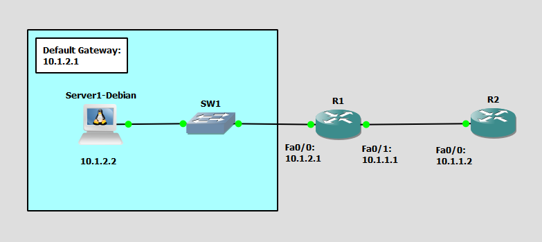

# Configure and Verify NTP
This is a guide to configure and verify NTP on the routers.



List of Devices:
- Routers:
    - Quantity: 2
    - Device Name: Cisco 3745
- Switch:
    - Quantity: 1
    - Device Name: Ethernet switch
- Server:
	- Quantity: 1
	- Device Name: Debian 12.6

## IP Address Table for the Routers
R1:
- Interface FastEthernet 0/0
	- IPv4 Address: 10.1.2.1
	- Subnet Mask: 255.255.255.0
- Interface FastEthernet 0/1
	- IPv4 Address: 10.1.1.1
	- Subnet Mask: 255.255.255.0

R2:
- Interface FastEthernet 0/0
	- IPv4 Address: 10.1.1.2
	- Subnet Mask: 255.255.255.0

## IP Address Table for the Server
Server1:
- IPv4 Address: 10.1.2.2
- Subnet Mask: 255.255.255.0
- Default Gateway: 10.1.2.1

## Configure IP Addresses for the Routers
Configure IP addresses on the interfaces of the routers. 

Interface FastEthernet 0/0 on R1:
```
R1# conf t
R1(config)# int Fa0/0
R1(config-if)# ip add 10.1.2.1 255.255.255.0
R1(config-if)# no shut
R1(config-if)# exit
```

Interface FastEthernet 0/1 on R1:
```
R1(config)# int Fa0/1
R1(config-if)# ip add 10.1.1.1 255.255.255.0
R1(config-if)# no shut
R1(config-if)# end
```

Interface FastEthernet 0/0 on R2:
```
R2# conf t
R2(config)# int Fa0/0
R2(config-if)# ip add 10.1.1.2 255.255.255.0
R2(config-if)# no shut
R2(config-if)# end
```

## Configure the IP Address for the Server
Configure the IP address for the server.

**Server1 - Debian**

This is the username and password for the Debian VMs:
- username: debian
- password: debian

On Server1, open the file, `/etc/network/interfaces`:
```
debian@Server1:~$ sudo vim /etc/network/interfaces
```

Configure the IP address for Server1 in `/etc/network/interfaces`:
```
auto ens4
iface ens4 inet static
    address 10.1.2.2
    netmask 255.255.255.0
    gateway 10.1.2.1
```

Restart the networking service using the rc-service command:
```
debian@Server1:~$ sudo systemctl restart networking
```

Check the IP address of the interface ens4:
```
debian@Server1:~$ ip addr show
```

## Configure NTP
Configure NTP on the routers

Configure the NTP master on R1:
```
R1# conf t
R1(config)# ntp master 2
R1(config)# end
```

Configure the NTP client on R2:
```
R2# conf t
R2(config)# ntp server 10.1.1.1
R2(config)# end
```

## Verify NTP on the Client Router
Verify the NTP of the client router.

Verify the NTP configuration on R2:
```
R2# show ntp associations
```

Verify the NTP status on R2:
```
R2# show ntp status
```

## Check Connectivity Between the Devices
Ping the device to check if the server can communicate with the device.

**Server1 - Debian**

Ping the device from Server1.

Ping R1:
```
debian@Server1:~$ ping 10.1.2.1
```

## Save Router Configurations
For each router, save the running config to the startup config.

Save config for R1:
```
R1# copy run start
```

Save config for R2:
```
R2# copy run start
```