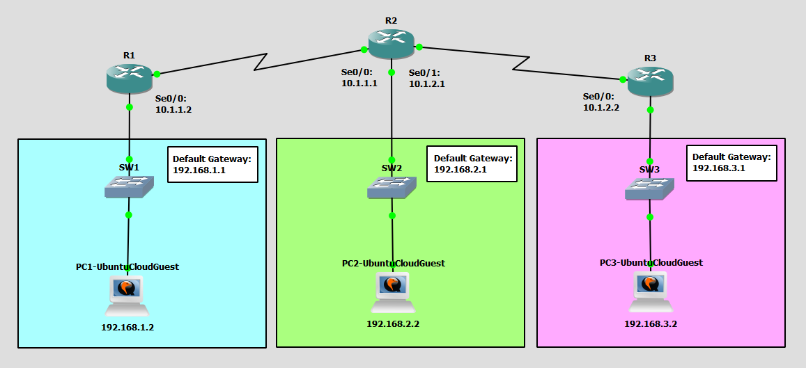

# Configure and Verify Single Area OSPFv2
This is a guide to configure and verify Single Area OSPFv2.



List of Devices:
- Router:
	- Device Name: Cisco 3745
	- Quantity: 3
- Switch:
	- Device Name: Ethernet switch
	- Quantity: 3
- PC:
	- Device Name: Ubuntu Cloud Guest 24.10
	- Quantity: 3

## IP Address Table for the PCs
PC1:
- IPv4 Address: 192.168.1.2
- Subnet Mask: 255.255.255.0
- Default Gateway: 192.168.1.1

PC2:
- IPv4 Address: 192.168.2.2
- Subnet Mask: 255.255.255.0
- Default Gateway: 192.168.2.1

PC3:
- IPv4 Address: 192.168.3.2
- Subnet Mask: 255.255.255.0
- Default Gateway: 192.168.3.1

## IP Address Table for the Routers
R1:
- FastEthernet0/0
	- IPv4 Address: 192.168.1.1
	- Subnet Mask: 255.255.255.0
- Serial0/0
	- IPv4 Address: 10.1.1.2
	- Subnet Mask: 255.255.255.0

R2:
- FastEthernet0/0
	- IPv4 Address: 192.168.2.1
	- Subnet Mask: 255.255.255.0
- Serial0/0
	- IPv4 Address: 10.1.1.1
	- Subnet Mask: 255.255.255.0
- Serial0/1
	- IPv4 Address: 10.1.2.1
	- Subnet Mask: 255.255.255.0

R3:
- FastEthernet0/0
	- IPv4 Address: 192.168.3.1
	- Subnet Mask: 255.255.255.0
- Serial0/0
	- IPv4 Address: 10.1.2.2
	- Subnet Mask: 255.255.255.0

## Configure IP Addresses for the Routers
Configure the IP address for the interfaces of the routers.

Interface FastEthernet0/0 for R1:
```
R1# conf t
R1(config)# int Fa0/0
R1(config-if)# ip add 192.168.1.1 255.255.255.0
R1(config-if)# no shut
R1(config-if)# exit
```

Interface Serial0/0 for R1:
```
R1(config)# int Se0/0
R1(config-if)# ip add 10.1.1.2 255.255.255.0
R1(config-if)# no shut
R1(config-if)# end
```

Interface FastEthernet0/0 for R2:
```
R2# conf t
R2(config)# int Fa0/0
R2(config-if)# ip add 192.168.2.1 255.255.255.0
R2(config-if)# no shut
R2(config-if)# exit
```

Interface Serial0/0 for R2:
```
R2(config)# int Se0/0
R2(config-if)# ip add 10.1.1.1 255.255.255.0
R2(config-if)# no shut
R2(config-if)# exit
```

Interface Serial0/1 for R2:
```
R2(config)# int Se0/1
R2(config-if)# ip add 10.1.2.1 255.255.255.0
R2(config-if)# no shut
R2(config-if)# end
```

Interface FastEthernet0/0 for R3:
```
R3# conf t
R3(config)# int Fa0/0
R3(config-if)# ip add 192.168.3.1 255.255.255.0
R3(config-if)# no shut
R3(config-if)# exit
```

Interface Serial0/0 for R3:
```
R3(config)# int Se0/0
R3(config-if)# ip add 10.1.2.2 255.255.255.0
R3(config-if)# no shut
R3(config-if)# end
```

## Configure Dynamic Routing via OSPF
Configure the dynamic routes via OSPF for the routers.

Configure OSPF for R1:
```
R1# conf t
R1(config)# router ospf 1
R1(config-router)# network 10.1.1.0 0.0.0.255 area 0
R1(config-router)# network 192.168.1.0 0.0.0.255 area 0
R1(config-router)# end
```

Configure OSPF for R2:
```
R2# conf t
R2(config)# router ospf 1
R2(config-router)# network 10.1.1.0 0.0.0.255 area 0
R2(config-router)# network 10.1.2.0 0.0.0.255 area 0
R2(config-router)# network 192.168.2.0 0.0.0.255 area 0
R2(config-router)# end
```

Configure OSPF for R3:
```
R3# conf t
R3(config)# router ospf 1
R3(config-router)# network 10.1.2.0 0.0.0.255 area 0
R3(config-router)# network 192.168.3.0 0.0.0.255 area 0
R3(config-router)# end
```

## Configure the IP Address for the PCs
Configure the IP address for the PCs.

**PC1 - Ubuntu Cloud Guest**

This is the username and password for the Ubuntu VMs:
- username: ubuntu
- password: ubuntu

On PC1, open the file, `/etc/netplan/50-cloud-init.yaml`.
```
ubuntu@PC1:~$ sudo vim /etc/netplan/50-cloud-init.yaml
```

Configure the IP address for PC1 in `/etc/netplan/50-cloud-init.yaml`:
```
network:
    version: 2
    ethernets:
        ens3:
            addresses: [192.168.1.2/24]
            routes:
              - to: default
                via: 192.168.1.1
            dhcp4: false
```

Update the networking configuration using the netplan command:
```
ubuntu@PC1:~$ sudo netplan apply
```

Check the IP address of the interface eth0:
```
ubuntu@PC1:~$ ip addr show
```

**PC2 - Ubuntu Cloud Guest**

This is the username and password for the Ubuntu VMs:
- username: ubuntu
- password: ubuntu

On PC2, open the file, `/etc/netplan/50-cloud-init.yaml`:
```
ubuntu@PC2:~$ sudo vim /etc/netplan/50-cloud-init.yaml
```

Configure the IP address for PC2 in `/etc/netplan/50-cloud-init.yaml`:
```
network:
    version: 2
    ethernets:
        ens3:
            addresses: [192.168.2.2/24]
            routes:
              - to: default
                via: 192.168.2.1
            dhcp4: false
```

Update the networking configuration using the netplan command:
```
ubuntu@PC2:~$ sudo netplan apply
```

Check the IP address of the interface eth0:
```
ubuntu@PC2:~$ ip addr show
```

**PC3 - Ubuntu Cloud Guest**

This is the username and password for the Ubuntu VMs:
- username: ubuntu
- password: ubuntu

On PC3, open the file, `/etc/netplan/50-cloud-init.yaml`:
```
ubuntu@PC3:~$ sudo vim /etc/netplan/50-cloud-init.yaml
```

Configure the IP address for PC3 in `/etc/netplan/50-cloud-init.yaml`:
```
network:
    version: 2
    ethernets:
        ens3:
            addresses: [192.168.3.2/24]
            routes:
              - to: default
                via: 192.168.3.1
            dhcp4: false
```

Update the networking configuration using the netplan command:
```
ubuntu@PC3:~$ sudo netplan apply
```

Check the IP address of the interface eth0:
```
ubuntu@PC3:~$ ip addr show
```

## Check Connectivity Between the PCs
Ping each PC to check if the PCs can communicate with each other.

**PC1 - UbuntuCloudGuest**

Ping the PCs from PC1.

Ping PC2:
```
ubuntu@PC1:~$ ping 192.168.2.2
```

Ping PC3:
```
ubuntu@PC1:~$ ping 192.168.3.2
```

**PC2 - UbuntuCloudGuest**

Ping the PCs from PC2.

Ping PC1:
```
ubuntu@PC2:~$ ping 192.168.1.2
```

Ping PC3:
```
ubuntu@PC2:~$ ping 192.168.3.2
```

**PC3 - UbuntuCloudGuest**

Ping the PCs from PC3.

Ping PC1:
```
ubuntu@PC3:~$ ping 192.168.1.2
```

Ping PC2:
```
ubuntu@PC3:~$ ping 192.168.2.2
```

## Save Router Configurations
Go to each router and save the running configuration to the startup configuration.

Save config for R1:
```
R1# copy run start
```

Save config for R2:
```
R2# copy run start
```

Save config for R3:
```
R3# copy run start
```

## Resources
- [OSPF Implementation - GeeksforGeeks](https://www.geeksforgeeks.org/computer-networks/ospf-implementation/)