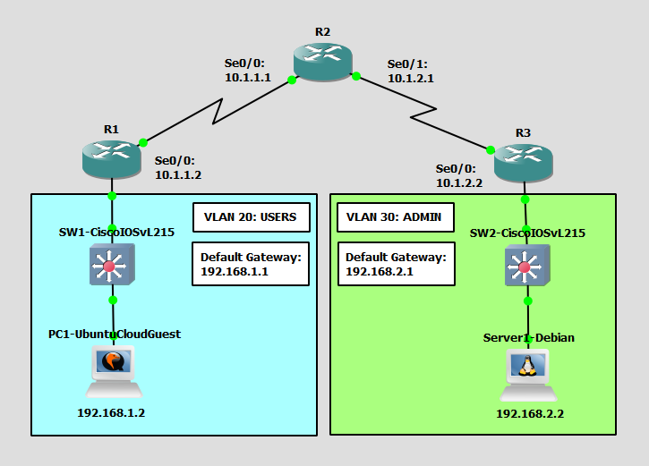

# Configure and Verify VLANs
This is a guide to configure and verify VLANs with switches.



List of Devices:
- Routers:
	- Device Name: Cisco 3745
	- Quantity: 3
- Switches:
	- Device Name: Cisco IOSvL215.2
	- Quantity: 2
- Ubuntu Linux PC:
	- Device Name: Ubuntu Cloud Guest 24.10
	- Quantity: 1
- Debian Linux Server:
	- Device Name: Debian 12.6
	- Quantity: 1

## IP Address Table for the Routers
R1:
- Interface: Serial 0/0
	- IPv4 Address: 10.1.1.2
	- Subnet Mask: 255.255.255.0
- Interface: FastEthernet 0/0
	- IPv4 Address: 192.168.1.1
	- Subnet Mask: 255.255.255.0

R2:
- Interface: Serial 0/0
	- IPv4 Address: 10.1.1.1
	- Subnet Mask: 255.255.255.0
- Interface: Serial 0/1
	- IPv4 Address: 10.1.2.1
	- Subnet Mask: 255.255.255.0

R3:
- Interface: Serial 0/0
	- IPv4 Address: 10.1.2.2
	- Subnet Mask: 255.255.255.0
- Interface: FastEthernet 0/0
	- IPv4 Address: 192.168.2.1
	- Subnet Mask: 255.255.255.0

## IP Address Table for the PC
PC1:
- IPv4 Address: 192.168.1.2
- Subnet Mask: 255.255.255.0
- Default Gateway: 192.168.1.1

## IP Address Table for the Server
Server1:
- IPv4 Address: 192.168.2.2
- Subnet Mask: 255.255.255.0
- Default Gateway: 192.168.2.1

## Configure IP Addresses of the Routers
Configure the IP address for the interfaces of the routers.

Interface Serial 0/0 on R1:
```
R1# conf t
R1(config)# int Se0/0
R1(config-if)# ip add 10.1.1.2 255.255.255.0
R1(config-if)# no shut
R1(config-if)# exit
```

Interface FastEthernet 0/0 on R1:
```
R1# conf t
R1(config)# int Fa0/0
R1(config-if)# ip add 192.168.1.1 255.255.255.0
R1(config-if)# no shut
R1(config-if)# end
```

Interface Serial 0/0 on R2:
```
R2# conf t
R2(config)# int Se0/0
R2(config-if)# ip add 10.1.1.1 255.255.255.0
R2(config-if)# no shut
R2(config-if)# exit
```

Interface Serial 0/1 on R2:
```
R2# conf t
R2(config)# int Se0/1
R2(config-if)# ip add 10.1.2.1 255.255.255.0
R2(config-if)# no shut
R2(config-if)# end
```

Interface Serial 0/0 on R3:
```
R3# conf t
R3(config)# int Se0/0
R3(config-if)# ip add 10.1.2.2 255.255.255.0
R3(config-if)# no shut
R3(config-if)# exit
```

Interface FastEthernet 0/0 on R3:
```
R3# conf t
R3(config)# int Fa0/0
R3(config-if)# ip add 192.168.2.1 255.255.255.0
R3(config-if)# no shut
R3(config-if)# end
```

## Configure the IP Address for the PC
Configure the IP address for the PC.

This is the username and password for the Ubuntu VMs:
- username: ubuntu
- password: ubuntu

On PC1, open the file, `/etc/netplan/50-cloud-init.yaml`:
```
ubuntu@PC1:~$ vim /etc/netplan/50-cloud-init.yaml
```

Configure the IP address for PC1 in `/etc/netplan/50-cloud-init.yaml`:
```
network:
    version: 2
    ethernets:
        ens3:
            addresses: [192.168.1.2/24]
            routes:
              - to: default
                via: 192.168.1.1
            dhcp4: false
```

Update the networking configuration using the netplan command:
```
ubuntu@PC1:~$ sudo netplan apply
```

Check the IP address of the interface eth0:
```
ubuntu@PC1:~$ ip addr show
```

## Configure the IP Address for the Server
This is the username and password for the Debian VMs:
- username: debian
- password: debian

On Server1, open the file, `/etc/network/interfaces`.
```
debian@Server1:~$ sudo vim /etc/network/interfaces
```

Configure the IP address for Server1 in `/etc/network/interfaces`:
```
auto ens4
iface ens4 inet static
    address 192.168.2.2
    netmask 255.255.255.0
    gateway 192.168.2.1
```

Restart the networking service using the rc-service command
```
debian@Server1:~$ sudo systemctl restart networking
```

Check the IP address of the interface ens4:
```
debian@Server1:~$ ip addr show
```

## Configure VLANs for the Switches
Configure the VLANs for the switches. You will create a VLAN called USERS for the PCs and a VLANs called ADMIN for the servers.

**SW1**

Show the default VTP status on SW1:
```
SW1> show vtp status
```

Create a VLAN for USERS on SW1:
```
SW1> en
SW1# conf t
SW1(config)# vlan 20
SW1(config-vlan)# name USERS
SW1(config-vlan)# exit
```

Verify the VLANs on SW1:
```
SW1(config)# do show vlan brief
```

Assign VLANs to the interfaces on SW1.

Interface GigabitEthernet 0/0 on SW1:
```
SW1(config)# int Gig0/0
SW1(config-if)# switchport mode access
SW1(config-if)# switchport access vlan 20
SW1(config-if)# exit
```

Interface GigabitEthernet 0/1 on SW1:
```
SW1(config)# int Gig0/1
SW1(config-if)# switchport mode access
SW1(config-if)# switchport access vlan 20
SW1(config-if)# end
```

Verify the VLANs of the interfaces on SW1:
```
SW1# show vlan brief
```

Verify the VLAN for interface Gig0/0 on SW1:
```
SW1# show int Gig0/0 switchport
```

Verify the VLAN for interface Gig0/1 on SW1:
```
SW1# show int Gig0/1 switchport
```

**SW2**

Show the default VTP status on SW2:
```
SW2> show vtp status
```

Create a VLAN for ADMIN on SW2:
```
SW2> en
SW2# conf t
SW2(config)# vlan 30
SW2(config-vlan)# name ADMIN
SW2(config-vlan)# exit
```

Verify the VLANs on SW2:
```
SW2(config)# do show vlan brief
```

Assign VLANs to the interfaces on SW2.

Interface GigabitEthernet 0/0 on SW2:
```
SW2(config)# int Gig0/0
SW2(config-if)# switchport mode access
SW2(config-if)# switchport access vlan 30
SW2(config-if)# exit
```

Interface GigabitEthernet 0/1 on SW2:
```
SW2(config)# int Gig0/1
SW2(config-if)# switchport mode access
SW2(config-if)# switchport access vlan 30
SW2(config-if)# end
```

Verify the VLANs of the interfaces on SW2:
```
SW2# show vlan brief
```

Verify the VLAN for interface Gig0/0 on SW2:
```
SW2# show int Gig0/0 switchport
```

Verify the VLAN for interface Gig0/1 on SW2:
```
SW2# show int Gig0/1 switchport
```

## Check Connectivity of the PCs
Ping each router to check if the PCs can communicate with the router.

**PC1 - Ubuntu Cloud Guest**

Ping the router from PC1.

Ping R1:
```
ubuntu@PC1:~$ ping 192.168.1.1
```

**PC2 - Debian**

Ping the router from PC2.

Ping R2:
```
debian@Server1:~$ ping 192.168.2.1
```

## Save Router Configurations

Go to each router and save the running configuration to the startup configuration.

Save the config for R1:
```
R1# copy run start
```

Save the config for R2:
```
R2# copy run start
```

Save the config for R3:
```
R3# copy run start
```

## Save Switch Configurations

Go to each switch and save the running configuration to the startup configuration.

Save the config for SW1:
```
SW1# copy run start
```

Save the config for SW2:
```
SW2# copy run start
```

## Resources
- [Cisco VoIP Phone Configuration Guide - UniNets](https://www.uninets.com/blog/configure-cisco-voip)
- [How to Configure DHCP in Cisco Packet Tracer - SYSNETTECH Solutions](https://www.sysnettechsolutions.com/en/configure-dhcp-in-cisco-packet-tracer/)
- [3.3.12 Packet Tracer – VLAN Configuration (Instructions Answer) - ITExamAnswers.net](https://itexamanswers.net/3-3-12-packet-tracer-vlan-configuration-instructions-answer.html)
- [How do I set a static IP in Ubuntu? - ask Ubuntu](https://askubuntu.com/questions/766131/how-do-i-set-a-static-ip-in-ubuntu)
- [Configuring networks - Ubuntu Server](https://ubuntu.com/server/docs/explanation/networking/configuring-networks/)