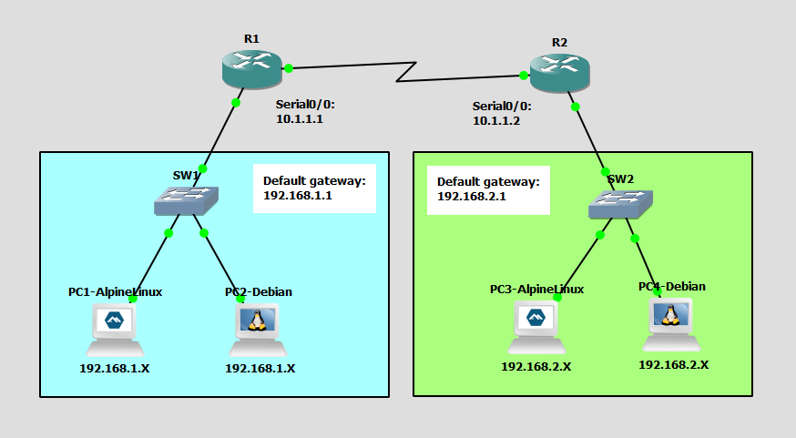

# Configure Router as DHCP Server
This is a guide to configure the router as a DHCP server.



List of Devices:
- Routers:
	- Device Name: Cisco 3745
	- Quantity: 2
- Switches:
	- Device Name: Ethernet switch
	- Quantity: 2
- Alpine Linux PCs:
	- Device Name: Alpine Linux Virt 3.18.4
	- Quantity: 2
- Debian Linux PCs:
	- Device Name: Debian 12.6
	- Quantity: 2

## IP Address Table for the PCs
PC1:
- IPv4 Address: 192.168.1.X
- Subnet Mask: 255.255.255.0
- Default Gateway: 192.168.1.1

PC2:
- IPv4 Address: 192.168.1.X
- Subnet Mask: 255.255.255.0
- Default Gateway: 192.168.1.1

PC3:
- IPv4 Address: 192.168.2.X
- Subnet Mask: 255.255.255.0
- Default Gateway: 192.168.2.1

PC4:
- IPv4 Address: 192.168.2.X
- Subnet Mask: 255.255.255.0
- Default Gateway: 192.168.2.1

## IP Address Table for the Routers
R1:
- Interface: Serial0/0: 
    - IPv4 Address: 10.1.1.1
    - Subnet Mask: 255.255.255.0
- Interface: FastEthernet0/0: 
    - IPv4 Address: 192.168.1.1
    - Subnet Mask: 255.255.255.0

R2:
- Interface: Serial0/0
    - IPv4 Address: 10.1.1.2
    - Subnet Mask: 255.255.255.0
- Interface: FastEthernet0/0
    - IPv4 Address: 192.168.2.1
    - Subnet Mask: 255.255.255.0

## Configure IP Address of the Routers
Configure the IP address of the interfaces of the routers.

Interface Serial0/0 for R1:
```
R1# conf t
R1(config)# int Serial0/0
R1(config-if)# ip add 10.1.1.1 255.255.255.0
R1(config-if)# no shut
R1(config-if)# exit
```

Interface FastEthernet0/0 for R1:
```
R1# conf t
R1(config)# int FastEthernet0/0
R1(config-if)# ip add 192.168.1.1 255.255.255.0
R1(config-if)# no shut
R1(config-if)# end
```

Interface Serial0/0 for R2:
```
R2# conf t
R2(config)# int Serial0/0
R2(config-if)# ip add 10.1.1.2 255.255.255.0
R2(config-if)# no shut
R1(config-if)# exit
```

Interface FastEthernet0/0 for R2:
```
R2# conf t 
R2(config)# int FastEthernet0/0
R2(config-if)# ip add 192.168.2.1 255.255.255.0  
R2(config-if)# no shut
R1(config-if)# end
```

## Configure Static Routing
Configure static routes for the routers.

Configure a static route on R1:
```
R1# config t 
R1(config)# ip route 192.168.2.0 255.255.255.0 10.1.1.2
```

Configure a static route on R2:
```
R2#config t 
R2(config)# ip route 192.168.1.0 255.255.255.0 10.1.1.1
```

## Configure DHCP
Configure DHCP on the routers.

Create a DHCP pool called Pool0DHCP with the following IP addresses for the network, default-router, and dns-server on R1.
```
R1# conf t
R1(config)# ip dhcp excluded-address 192.168.1.1 192.168.1.10
R1(config)# ip dhcp pool Pool0DHCP
R1(dhcp-config)# network 192.168.1.0 255.255.255.0
R1(dhcp-config)# default-router 192.168.1.1
R1(dhcp-config)# dns-server 192.168.1.1
R1(dhcp-config)# end
```

Create a DHCP pool called Pool0DHCP with the following IP addresses for the network, default-router, and dns-server on R2.
```
R2# conf t
R2(config)# ip dhcp excluded-address 192.168.2.1 192.168.2.10
R2(config)# ip dhcp pool Pool0DHCP
R2(dhcp-config)# network 192.168.2.0 255.255.255.0
R2(dhcp-config)# default-router 192.168.2.1
R2(dhcp-config)# dns-server 192.168.2.1
R2(dhcp-config)# end
```

## Configure the IP Address for the PCs
Configure the IP address for the PCs.

**PC1 - Alpine Linux**

On PC1, open the file, `/etc/network/interfaces`:
```
PC1:~# vi /etc/network/interfaces
```

Configure DHCP for PC1 in `/etc/network/interfaces`:
```
auto eth0
iface eth0 inet dhcp
```

Restart the networking service using the rc-service command
```
PC1:~# rc-service networking restart
```

Check the IP address of the interface eth0:
```
PC1:~# ip addr show
```

**PC2 - Debian**

This is the username and password for the Debian VMs:
- username: debian
- password: debian

On PC2, open the file, `/etc/network/interfaces`:
```
debian@PC2:~$ sudo vim /etc/network/interfaces
```

Configure DHCP for PC2 in `/etc/network/interfaces`:
```
auto ens4
allow-hotplug ens4
iface ens4 inet dhcp
```

Restart the networking service using the rc-service command:
```
debian@PC2:~$ sudo systemctl restart networking
```

Check the IP address of the interface ens4:
```
debian@PC2:~$ ip addr show
```

**Note**: You probably have to restart the networking service twice for the static IP address to go away.

**PC3 - Alpine Linux**

On PC3, open the file, `/etc/network/interfaces`:
```
PC3:~# vi /etc/network/interfaces
```

Configure DHCP for PC3 in `/etc/network/interfaces`:
```
auto eth0
iface eth0 inet dhcp
```

Restart the networking service using the rc-service command:
```
PC3:~# rc-service networking restart
```

Check the IP address of the interface eth0:
```
PC3:~# ip addr show
```

**PC4 - Debian**

On PC4, open the file, `/etc/network/interfaces`:
```
debian@PC4:~$ sudo vim /etc/network/interfaces
```

Configure DHCP for PC4 in `/etc/network/interfaces`:
```
auto ens4
allow-hotplug ens4
iface ens4 inet dhcp
```

Restart the networking service using the rc-service command:
```
debian@PC4:~$ sudo systemctl restart networking
```

Check the IP address of the interface ens4:
```
debian@PC4:~$ ip addr show
```

**Note**: You probably have to restart the networking service twice for the static IP address to go away.

## Check Connectivity Between the PCs
Ping each PC to check if the PCs can communicate with each other.

Ping PCs from PC1.

Ping PCs from PC2.

Ping PCs from PC3.

Ping PCs from PC4.

## Save Router Configurations
For each router, save the running config to the startup config.

**Note**: Make sure to save the configuration of the routers. This will save your progress. Whenever you close the project, your configurations will be saved.

Save config for R1:
```
R1# copy run start
```

Save config for R2:
```
R2# copy run start
```

## Resources
- [How to configure static IP address on Alpine Linux - nixCraft](https://www.cyberciti.biz/faq/how-to-configure-static-ip-address-on-alpine-linux/)
- [How to restart network service in Alpine Linux - nixCraft](https://www.cyberciti.biz/faq/restarting-network-service-in-alpine-linux/)
- [Alpine Linux Change Hostname (computer name) - nixCraft](https://www.cyberciti.biz/faq/alpine-linux-change-hostname-computer-name/)
- [NetworkConfiguration - Debian](https://wiki.debian.org/NetworkConfiguration)
- [Configure Networking - Alpine Linux](https://wiki.alpinelinux.org/wiki/Configure_Networking)