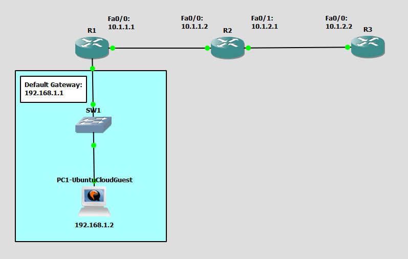

# Configure SSH
This is a guide to configure SSH on the routers.



List of Devices:
- Routers:
	- Quantity: 3
	- Device Name: Cisco 3745
- Switches:
	- Quantity: 1
	- Device Name: Ethernet switch
- PCs:
	- Quantity: 1
	- Device Name: Ubuntu Cloud Guest 24.10

## IP Address Table for the Routers
R1:
- Interface FastEthernet 0/0
	- IPv4 Address: 10.1.1.1
	- Subnet Mask: 255.255.255.0
- Interface FastEthernet 0/1
	- IPv4 Address: 192.168.1.1
	- Subnet Mask: 255.255.255.0

R2:
- Interface FastEthernet 0/0
	- IPv4 Address: 10.1.1.2
	- Subnet Mask: 255.255.255.0
- Interface FastEthernet 0/1
	- IPv4 Address: 10.1.2.1
	- Subnet Mask: 255.255.255.0

R3:
- Interface FastEthernet 0/0
	- IPv4 Address: 10.1.2.2
	- Subnet Mask: 255.255.255.0

## IP Address Table for PC
PC1:
- IPv4 Address: 192.168.1.2
- Subnet Mask: 255.255.255.0
- Default Gateway: 192.168.1.1

## Configure IP Addresses for Routers
Configure the IP address for the interfaces of the routers.

Interface FastEthernet 0/0 on R1:
```
R1# conf t
R1(config)# int Fa0/0
R1(config-if)# ip add 10.1.1.1 255.255.255.0
R1(config-if)# no shut
R1(config-if)# exit
```

Interface FastEthernet 0/1 on R1:
```
R1(config)# int Fa0/1
R1(config-if)# ip add 192.168.1.1 255.255.255.0
R1(config-if)# no shut
R1(config-if)# end
```

Interface FastEthernet 0/0 on R2:
```
R2# conf t
R2(config)# int Fa0/0
R2(config-if)# ip add 10.1.1.2 255.255.255.0
R2(config-if)# no shut
R2(config-if)# exit
```

Interface FastEthernet 0/1 on R2:
```
R2(config)# int Fa0/1
R2(config-if)# ip add 10.1.2.1 255.255.255.0
R2(config-if)# no shut
R2(config-if)# end
```

Interface FastEthernet 0/0 on R3:
```
R3# conf t
R3(config)# int Fa0/0
R3(config-if)# ip add 10.1.2.2 255.255.255.0
R3(config-if)# no shut
R3(config-if)# end
```

## Configure Static Routing
Configure static routing for the routers.

Configure a static route for R1:
```
R1# conf t
R1(config)# ip route 10.1.2.0 255.255.255.0 10.1.1.2
R1(config)# end
```

Configure a static route for R2:
```
R2# conf t
R2(config)# ip route 192.168.1.0 255.255.255.0 10.1.1.1
R2(config)# end
```

Configure static routes for R3:
```
R3# conf t
R3(config)# ip route 10.1.1.0 255.255.255.0 10.1.2.1
R3(config)# ip route 192.168.1.0 255.255.255.0 10.1.2.1
R3(config)# end
```

## Configure the IP Address for the PC
Configure the IP address for the PC.

**PC1 - Ubuntu Cloud Guest**

This is the username and password for the Ubuntu VMs:
- username: ubuntu
- password: ubuntu

On PC1, open the file, `/etc/netplan/50-cloud-init.yaml`.
```
ubuntu@PC1:~$ sudo vim /etc/netplan/50-cloud-init.yaml
```

Configure the IP address for PC1 in `/etc/netplan/50-cloud-init.yaml`:
```
network:
    version: 2
    ethernets:
        ens3:
            addresses: [192.168.1.2/24]
            routes:
              - to: default
                via: 192.168.1.1
            dhcp4: false
```

Update the networking configuration using the netplan command:
```
ubuntu@PC1:~$ sudo netplan apply
```

Check the IP address of the interface eth0:
```
ubuntu@PC1:~$ ip addr show
```

## Configure SSH for Routers
Configure SSH for the routers.

Configure SSH on R1:
```
R1# conf t
R1(config)# hostname R1
R1(config)# ip domain-name cisco.com
```

Create RSA keys of 1024 bits in size:
```
R1(config)# crypto key generate rsa
How many bits in the modulus [512]: 1024
```

Ensure SSH is only supported method:
```
R1(config)# line vty 0 4
R1(config-line)# transport input ssh
R1(config-line)# exit
```

Ensure that the SSH version is 2 on R1:
```
R1(config)# ip ssh version 2
R1(config)# end
```

Configure SSH on R2:
```
R2# conf t
R2(config)# hostname R2
R2(config)# ip domain-name cisco.com
R2(config)# crypto key generate rsa
How many bits in the modulus [512]: 1024

R2(config)# line vty 0 4
R2(config-line)# transport input ssh
R2(config-line)# exit
R2(config)# ip ssh version 2
R2(config)# end
```

Configure SSH on R3:
```
R3# conf t
R3(config)# hostname R2
R3(config)# ip domain-name cisco.com
R3(config)# crypto key generate rsa
How many bits in the modulus [512]: 1024

R3(config)# line vty 0 4
R3(config-line)# transport input ssh
R3(config-line)# exit
R3(config)# ip ssh version 2
R3(config)# end
```

## Configure Admin and Enable Password
Configure an admin and enable password for the routers.

Configure an admin password for R1:
```
R1# conf t
R1(config)# aaa new-model
R1(config)# aaa authentication login default local
R1(config)# username admin privilege 15 secret cisco
R1(config)# line con 0
R1(config-line)# login authentication default
R1(config-line)# exit
```

Configure an enable password for R1:
```
R1(config)# enable secret cisco
R1(config)# line vty 0 4
R1(config-line)# password cisco
R1(config-line)# login authentication default
R1(config-line)# end
```

Configure an admin password for R2:
```
R2# conf t
R2(config)# aaa new-model
R2(config)# aaa authentication login default local
R2(config)# username admin privilege 15 secret cisco
R2(config)# line con 0
R2(config-line)# login authentication default
R2(config-line)# exit
```

Configure an enable password for R2:
```
R2(config)# enable secret cisco
R2(config)# line vty 0 4
R2(config-line)# password cisco
R2(config-line)# login authentication default
R2(config-line)# end
```

Configure an admin password for R3:
```
R3# conf t
R3(config)# aaa new-model
R3(config)# aaa authentication login default local
R3(config)# username admin privilege 15 secret cisco
R3(config)# line con 0
R3(config-line)# login authentication default
R3(config-line)# exit
```

Configure an enable password for R3:
```
R3(config)# enable secret cisco
R3(config)# line vty 0 4
R3(config-line)# password cisco
R3(config-line)# login authentication default
R3(config-line)# end
```

## Configure SSH on the PC
Configure SSH on the PC. This will allow you to SSH to the routers from the PC.

Open the SSH config on PC1:
```
ubuntu@PC1:~$ vim ~/.ssh/config
```

Modify the SSH config at `~/.ssh/config` for PC1:
```
host *
		KexAlgorithms=+diffie-hellman-group1-sha1
        HostKeyAlgorithms=+ssh-rsa
        Ciphers aes128-ctr,aes192-ctr,aes256-ctr,aes128-cbc,3des-cbc
```

## Test SSH Connections
Test the SSH connections from the PC to the routers.

Admin password for the Cisco routers: cisco
Enable password for the Cisco routers: cisco

Test the SSH connection with R1 from PC1:
```
ubuntu@PC1:~$ ssh admin@192.168.1.1
```

Enter privileged EXEC Mode on R1:
```
R1> en
Password:

R1#
```

Test the SSH connection with R2 from PC1:
```
ubuntu@PC1:~$ ssh admin@10.1.1.2
```

Enter privileged EXEC Mode on R2:
```
R2> en
Password:

R2#
```

Test the SSH connection with R3 from PC1:
```
ubuntu@PC1:~$ ssh admin@10.1.2.2
```

Enter privileged EXEC Mode on R3:
```
R3> en
Password:

R3#
```

## Save Router Configurations
Save the running config to the startup config for the routers.

Saving config for R1:
```
R1# copy run start
```

Saving config for R2:
```
R2# copy run start
```

Saving config for R3:
```
R3# copy run start
```

## Resources
- [IP Domain-name Command on CISCO Router/Switch - ITExamAnswers.net](https://itexamanswers.net/ip-domain-name-command-on-cisco-router-switch.html)
- [Configure SSH on Routers - Cisco Systems, Inc.](https://www.cisco.com/c/en/us/support/docs/security-vpn/secure-shell-ssh/4145-ssh.html)