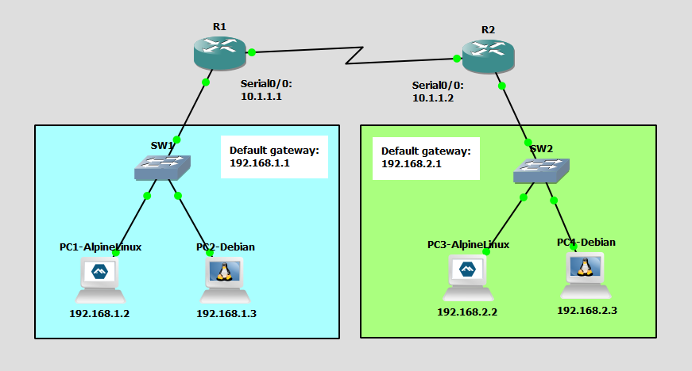

# Setup Network with Linux PCs
This is a guide to setup a network with Linux PCs.



## Devices
Router:
- Device Name: Cisco 3745
- Quantity: 2

Switch:
- Device Name: Ethernet switch
- Quantity: 2

Alpine Linux PCs:
- Device Name: Alpine Linux Virt 3.18.4
- Quantity: 2

Debian Linux PCs:
- Device Name: Debian 12.6
- Quantity: 2

## IP Address Table for the PCs
PC1:
- IPv4 Address: 192.168.1.2
- Subnet Mask: 255.255.255.0
- Default Gateway: 192.168.1.1

PC2:
- IPv4 Address: 192.168.1.3
- Subnet Mask: 255.255.255.0
- Default Gateway: 192.168.1.1

PC3:
- IPv4 Address: 192.168.2.2
- Subnet Mask: 255.255.255.0
- Default Gateway: 192.168.2.1

PC4:
- IPv4 Address: 192.168.2.3
- Subnet Mask: 255.255.255.0
- Default Gateway: 192.168.2.1

## IP Address Table for the Routers
R1:
- Serial0/0: 10.1.1.1
- Subnet Mask: 255.255.255.0
- FastEthernet0/0: 192.168.1.1
- Subnet Mask: 255.255.255.0

R2:
- Serial0/0: 10.1.1.2
- Subnet Mask: 255.255.255.0
- FastEthernet0/0: 192.168.2.1
- Subnet Mask: 255.255.255.0

## Configure the IP Address for the PCs
Configure the IP address for the PCs.

**PC1 - Alpine Linux**

On PC1, open the file, `/etc/network/interfaces`.
```
PC1:~# vi /etc/network/interfaces
```

Configure the IP address for PC1 in `/etc/network/interfaces`:
```
auto eth0
iface eth0 inet static
    address 192.168.1.2/24
    gateway 192.168.1.1
```

Restart the networking service using the rc-service command
```
PC1:~# rc-service networking restart
```

Check the IP address of the interface eth0:
```
ip addr show
```

**PC2 - Debian**

This is the username and password for the Debian VMs:
- username: debian
- password: debian

On PC2, open the file, `/etc/network/interfaces`.
```
debian@PC2:~$ sudo vim /etc/network/interfaces
```

Configure the IP address for PC2 in `/etc/network/interfaces`:
```
auto ens4
iface ens4 inet static
    address 192.168.1.3
    netmask 255.255.255.0
    gateway 192.168.1.1
```

Restart the networking service using the rc-service command
```
debian@PC2:~$ sudo systemctl restart networking
```

Check the IP address of the interface ens4:
```
ip addr show
```

**PC3 - Alpine Linux**

On PC3, open the file, `/etc/network/interfaces`.
```
PC3:~# vi /etc/network/interfaces
```

Configure the IP address for PC3 in `/etc/network/interfaces`:
```
auto eth0
iface eth0 inet static
    address 192.168.2.2/24
    gateway 192.168.2.1
```

Restart the networking service using the rc-service command:
```
PC3:~# rc-service networking restart
```

Check the IP address of the interface eth0:
```
ip addr show
```

**PC4 - Debian**

On PC4, open the file, `/etc/network/interfaces`.
```
debian@PC4:~$ sudo vim /etc/network/interfaces
```

Configure the IP address for PC4 in `/etc/network/interfaces`:
```
auto ens4
iface ens4 inet static
    address 192.168.2.3
    netmask 255.255.255.0
    gateway 192.168.2.1
```

Restart the networking service using the rc-service command
```
debian@PC4:~$ sudo systemctl restart networking
```

Check the IP address of the interface ens4:
```
ip addr show
```

## Configure IP Address for the Routers
Configure the IP address of the interfaces of the routers.

Interface Serial0/0 for R1:
```
R1# conf t
R1(config)# int Serial0/0
R1(config-if)# ip add 10.1.1.1 255.255.255.0
R1(config-if)# no shut
R1(config-if)# exit
```

Interface FastEthernet0/0 for R1:
```
R1# conf t
R1(config)# int FastEthernet0/0
R1(config-if)# ip add 192.168.1.1 255.255.255.0
R1(config-if)# no shut
R1(config-if)# end
```

Interface Serial0/0 for R2:
```
R2# conf t
R2(config)# int Serial0/0
R2(config-if)# ip add 10.1.1.2 255.255.255.0
R2(config-if)# no shut
R1(config-if)# exit
```

Interface FastEthernet0/0 for R2:
```
R2# conf t
R2(config)# int FastEthernet0/0
R2(config-if)# ip add 192.168.2.1 255.255.255.0
R2(config-if)# no shut
R1(config-if)# end
```

## Configure Static Routing
Configure static routes for the routers.

Configure a static route on R1:
```
R1# config t
R1(config)# ip route 192.168.2.0 255.255.255.0 10.1.1.2
```

Configure a static route on R2:
```
R2#config t
R2(config)# ip route 192.168.1.0 255.255.255.0 10.1.1.1
```

## Check Connectivity Between the PCs
Ping each PC to check if the PCs can communicate with each other.

**PC1 - Alpine Linux**

Ping PCs from PC1

Ping PC2:
```
PC1:~# ping 192.168.1.3
```

Ping PC3:
```
PC1:~# ping 192.168.2.2
```

Ping PC4:
```
PC1:~# ping 192.168.2.3
```

**PC2 - Debian**

Ping PCs from PC2

Ping PC1:
```
debian@PC2:~$ ping 192.168.1.2
```

Ping PC3:
```
debian@PC2:~$ ping 192.168.2.2
```

Ping PC4:
```
debian@PC2:~$ ping 192.168.2.3
```

**PC3 - Alpine Linux**

Ping PCs from PC3

Ping PC4:
```
PC3:~# ping 192.168.2.3
```

Ping -> PC1:
```
PC3:~# ping 192.168.1.2
```

Ping -> PC2:
```
PC3:~# ping 192.168.1.3
```

**PC4 - Debian**

Ping PCs from PC4

Ping PC3:
```
debian@PC4:~$ ping 192.168.2.2
```

Ping PC1:
```
debian@PC4:~$ ping 192.168.1.2
```

Ping PC2:
```
debian@PC4:~$ ping 192.168.1.3
```

## Save Router Configurations
For each router, save the running config to the startup config.

Save config for R1:
```
R1# copy run start
```

Save config for R2:
```
R2# copy run start
```

## Resources
- [How to configure static IP address on Alpine Linux - nixCraft](https://www.cyberciti.biz/faq/how-to-configure-static-ip-address-on-alpine-linux/)
- [How to restart network service in Alpine Linux - nixCraft](https://www.cyberciti.biz/faq/restarting-network-service-in-alpine-linux/)
- [Alpine Linux Change Hostname (computer name) - nixCraft](https://www.cyberciti.biz/faq/alpine-linux-change-hostname-computer-name/)