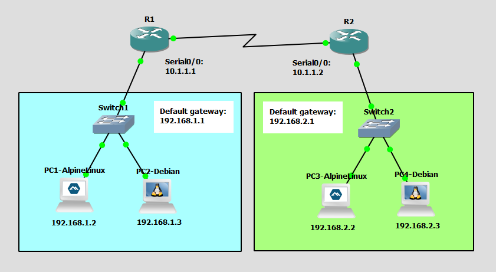

# Verify IP Parameters for Client OS
This is a guide to verify IP parameters for the client OS.



List of Devices:
- Routers:
	- Device Name: Cisco 3745
	- Quantity: 2
- Switches:
	- Device Name: Ethernet switch
	- Quantity: 2
- Alpine Linux PCs:
	- Device Name: Alpine Linux Virt 3.18.4
	- Quantity: 2
- Debian Linux PCs:
	- Device Name: Debian 12.6
	- Quantity: 2

## IP Address Table for the PCs
PC1:
- IPv4 Address: 192.168.1.2
- Subnet Mask: 255.255.255.0
- Default Gateway: 192.168.1.1

PC2:
- IPv4 Address: 192.168.1.3
- Subnet Mask: 255.255.255.0
- Default Gateway: 192.168.1.1

PC3:
- IPv4 Address: 192.168.2.2
- Subnet Mask: 255.255.255.0
- Default Gateway: 192.168.2.1

PC4:
- IPv4 Address: 192.168.2.3
- Subnet Mask: 255.255.255.0
- Default Gateway: 192.168.2.1

## IP Address Table for the Routers

R1:
- Interface: Serial0/0: 
	- IPv4 Address: 10.1.1.1
	- Subnet Mask: 255.255.255.0
- FastEthernet0/0: 
	- IPv4 Address: 192.168.1.1
	- Subnet Mask: 255.255.255.0

R2:
- Interface: Serial0/0: 
	- IPv4 Address: 10.1.1.2
	- Subnet Mask: 255.255.255.0
- FastEthernet0/0: 
	- IPv4 Address: 192.168.2.1
	- Subnet Mask: 255.255.255.0

## Configure IP Address of the Routers
Configure the IP address of the interfaces of the routers.

Interface Serial0/0 for R1:
```
R1# config t
R1(config)# int Se0/0
R1(config-if)# ip add 10.1.1.1 255.255.255.0
R1(config-if)# no shut
R1(config-if)# exit
```

Interface FastEthernet0/0 for R1:
```
R1# config t
R1(config)# int Fa0/0
R1(config-if)# ip add 192.168.1.1 255.255.255.0
R1(config-if)# no shut
R1(config-if)# exit
```

Interface Serial0/0 for R2:
```
R2# config t
R2(config)# int Se0/0
R2(config-if)# ip add 10.1.1.2 255.255.255.0
R2(config-if)# no shut
R1(config-if)# exit
```

Interface FastEthernet0/0 for R2:
```
R2# config t 
R2(config)# int Fa0/0
R2(config-if)# ip add 192.168.2.1 255.255.255.0  
R2(config-if)# no shut
R1(config-if)# exit
```

## Configure the IP Address for the PCs
Configure the IP address for the PCs.

**PC1 - Alpine Linux**

On PC1, open the file, `/etc/network/interfaces`.
```
PC1:~# vi /etc/network/interfaces
```

Configure the IP address for PC1 in `/etc/network/interfaces`:
```
auto eth0
iface eth0 inet static
    address 192.168.1.2/24
    gateway 192.168.1.1
```

Restart the networking service using the rc-service command
```
PC1:~# rc-service networking restart
```

**PC2 - Debian**

This is the username and password for the Debian VMs:
- username: debian
- password: debian

On PC2, open the file, `/etc/network/interfaces`.
```
debian@PC2:~$ sudo vim /etc/network/interfaces
```

Configure the IP address for PC2 in `/etc/network/interfaces`:
```
auto ens4
iface ens4 inet static
    address 192.168.1.3
    netmask 255.255.255.0
    gateway 192.168.1.1
```

Restart the networking service using the rc-service command
```
debian@PC2:~$ sudo systemctl restart networking
```

**PC3 - Alpine Linux**

On PC3, open the file, `/etc/network/interfaces`.
```
PC3:~# vi /etc/network/interfaces
```

Configure the IP address for PC3 in `/etc/network/interfaces`:
```
auto eth0
iface eth0 inet static
    address 192.168.2.2/24
    gateway 192.168.2.1
```

Restart the networking service using the rc-service command:
```
PC3:~# rc-service networking restart
```

**PC4 - Debian**

On PC4, open the file, `/etc/network/interfaces`.
```
debian@PC4:~$ sudo vim /etc/network/interfaces
```

Configure the IP address for PC4 in `/etc/network/interfaces`:
```
auto ens4
iface ens4 inet static
    address 192.168.2.3
    netmask 255.255.255.0
    gateway 192.168.2.1
```

Restart the networking service using the rc-service command
```
debian@PC4:~$ sudo systemctl restart networking
```
### Verify IP Parameters for the Client OS
Verify the IPv4 configuration on the client OS.

On the PCs, Go to Desktop -> Command Prompt.

Use the `ip` command on PC1:
```
PC1:~# ip addr show
```

Use the `ip` command on PC2:
```
debian@PC2:~$ ip addr show
```

Use the `ip` command on PC3:
```
PC3:~# ip addr show
```

Use the `ip` command on PC4:
```
debian@PC4:~$ ip addr show
```

**Note**: The `ip` command is used to check the IP address settings on Linux. The `ipconfig` command is used to check the IP address settings on Windows. The `ifconfig` command is used to check the IP address settings on macOS. 