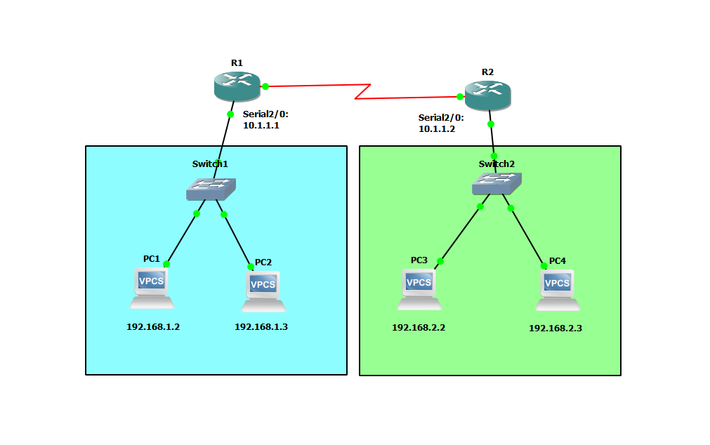

# WAN Network Tutorial - GNS3
This is a tutorial to setup a WAN network in GNS3.


## Devices
Router:
- Router Model Name: Cisco 3745 124-25d
- Quantity: 2

Switch:
- Switch Model Name: Ethernet switch
- Quantity: 2

PC:
- PC Model Name: VPCS
- Quantity: 4

## IP Address Table for PCs
PC1:
- IPv4 Address: 192.168.1.2
- Subnet Mask: 255.255.255.0
- Default Gateway: 192.168.1.1

PC2:
- IPv4 Address: 192.168.1.3
- Subnet Mask: 255.255.255.0
- Default Gateway: 192.168.1.1

PC3:
- IPv4 Address: 192.168.2.2
- Subnet Mask: 255.255.255.0
- Default Gateway: 192.168.2.1

PC4:
- IPv4 Address: 192.168.2.3
- Subnet Mask: 255.255.255.0
- Default Gateway: 192.168.2.1

## IP Address Table for Routers
R1:
- Serial2/0: 10.1.1.1
- Subnet Mask: 255.255.255.0
- FastEthernet0/0: 192.168.1.1
- Subnet Mask: 255.255.255.0

R2:
- Serial2/0: 10.1.1.2
- Subnet Mask: 255.255.255.0
- FastEthernet0/0: 192.168.2.1
- Subnet Mask: 255.255.255.0

## Configure the IP addresses for the PCs

Set the IP address and the default gateway address for PC1:
```
PC1> ip 192.168.1.2/24 192.168.1.1
```

Set the IP address and the default gateway address for PC2:
```
PC2> ip 192.168.1.3/24 192.168.1.1
```

Set the IP address and the default gateway address for PC3:
```
PC3> ip 192.168.2.2/24 192.168.2.1
```

Set the IP address and the default gateway address for PC4:
```
PC4> ip 192.168.2.3/24 192.168.2.1
```

## Configure IP Addresses for the Routers
Configure the IP addresses for the two routers. You have to configure the ip address for the FastEthernet0/0 and Serial2/0 ports for each router.

Interface Serial2/0 for R1:
```
R1#config t
R1(config)#int Serial2/0
R1(config-if)#ip add 10.1.1.1 255.255.255.0
R1(config-if)#no shut
R1(config-if)#exit
```

Interface FastEthernet0/0 for R1:
```
R1#config t
R1(config)#int FastEthernet0/0
R1(config-if)#ip add 192.168.1.1 255.255.255.0
R1(config-if)#no shut
R1(config-if)#exit
```

Interface Serial2/0 for R2:
```
R2#config t
R2(config)#int Serial2/0
R2(config-if)#ip add 10.1.1.2 255.255.255.0
R2(config-if)#no shut
R1(config-if)#exit
```

Interface FastEthernet0/0 for R2:
```
R2#config t 
R2(config)#int FastEthernet0/0
R2(config-if)#ip add 192.168.2.1 255.255.255.0  
R2(config-if)#no shut
R1(config-if)#exit
```

## Configure Routing
Configure static routes for the two routers in order for the PCs to communicate with each other.

R1:
```
R1#config t 
R1(config)#ip route 192.168.2.0 255.255.255.0 10.1.1.2
```

R2:
```
R2#config t 
R2(config)#ip route 192.168.1.0 255.255.255.0 10.1.1.1
```

## Check Connectivity Between PCs
Ping each PC to check if the four PCs can communicate with each other.

Ping PCs from PC1

PC1 -> PC2:
```
PC1> ping 192.168.1.3
```

PC1 -> PC3:
```
PC1> ping 192.168.2.2
```

PC1 -> PC4:
```
PC1> ping 192.168.2.3
```

Ping PCs from PC2

PC2 -> PC1:
```
PC2> ping 192.168.1.2
```

PC2 -> PC3:
```
PC2> ping 192.168.2.2
```

PC2 -> PC4:
```
PC2> ping 192.168.2.3
```

Ping PCs from PC3

PC3 -> PC4:
```
PC3> ping 192.168.2.3
```

PC3 -> PC1:
```
PC3> ping 192.168.1.2
```

PC3 -> PC2:
```
PC3> ping 192.168.1.3
```

Ping PCs from PC4

PC4 -> PC3:
```
PC4> ping 192.168.2.2
```

PC4 -> PC1:
```
PC4> ping 192.168.1.2
```

PC4 -> PC2:
```
PC4> ping 192.168.1.3
```

These should all work.

## Save Configs of the Appliances
Make sure to save the configurations for the routers and PCs. This will save your progress. Whenever you close the project, your configurations will be saved.

Save the router config for R1:
```
R1(config)#exit
R1#copy running-config startup-config
```

Save the router config for R2:
```
R2(config)#exit
R2#copy running-config startup-config
```

Save the PC config for PC1:
```
PC1> save
```

Save the PC config for PC2:
```
PC2> save
```

Save the PC config for PC3:
```
PC3> save
```

Save the PC config for PC4:
```
PC4> save
```

Congratulations, you setup a WAN network in GNS3.

## Resources
- [How to Configure VPCS on GNS3 - SYSNETTECH Solutions](https://www.sysnettechsolutions.com/en/configure-vpcs-gns3/#how-to-use-virtual-pc-simulator-vpcs-step-2)
- [Your First Cisco Topology - GNS3 Documentation](https://docs.gns3.com/docs/getting-started/your-first-cisco-topology)
- [VPCS - GNS3 Documentation](https://docs.gns3.com/docs/emulators/vpcs/)